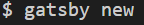
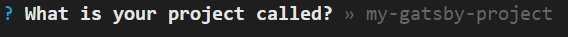
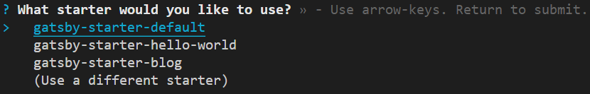
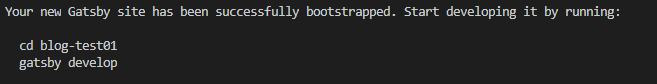
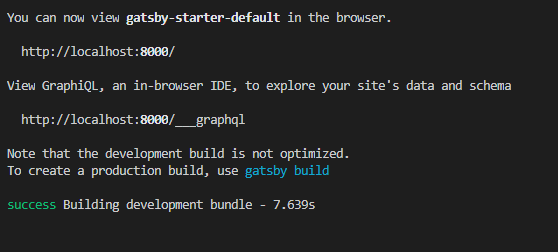
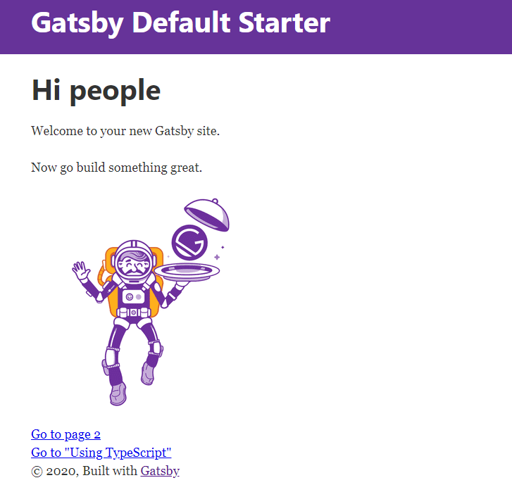

## スターターをダウンロードする

ターミナルでgatsby newを入力します。

プロジェクト名（ディレクトリ名）を入力します。

キーボードのカーソルでいずれかのスターターを選択してエンターを押します。

## ダウンロード完了

無事ダウンロードが完了したらディレクトリに移動して(cd blog-test01)、ビルド(gatsby develop)してみます。

ビルドが完了するとサーバーも立ち上がるので URL をコピー（http\://localhost:8000/）して確認してみます。

表示されれば成功です。
