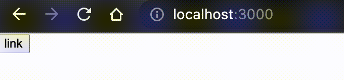

[前回](/nextjs-website-tutorial3)の続き  
ページ遷移時にアニメーションをつけたいと思って、いろいろ探しているうちに[React Transition Group](https://reactcommunity.org/react-transition-group/)へたどり着きました。

## 実現するまでに躓いたこと
### useState,useEffectで切り替え → ✕
CSSのクラスを定義しておいてuseStateで切り替えればいいのでは？と考えました。

```jsx
import type { NextPage } from 'next'
import { useState, useEffect } from 'react'
import { css } from '@emotion/css'

const bg = css`
  background-color: black;
`

const Home: NextPage = () => {
  const [isState,setIsState] = useState(false)
  useEffect(()=>{
    return (()=> setIsState(true))
  },[])
  return (
    <div className={isState ? bg : ""}>aaa</div>
  )
}
```

しかし、上記コードは２重の理由で実現できません。

#### 1.useEffectのクリーンアップ関数はcomponentWillUnmountではない
正確に理解していなかったし、現時点でも理解が怪しいと思いますが、一旦知識のアップデートプロセスは下記のようになっています。

- `useEffect` ののクリーンアップ関数(return)は `componentWillUnmount`、つまりコンポーネントが無くなる時に処理を解除する、、、と思っていた。
  - 解除する処理を記述するということは、「何かしら処理を行うことができる」ということ・・・！
- 決定的な理由はないが、何でもしていいわけではないよな…という認識もあった。
- 自身の考えはどうあれ、`useEffect`のクリーンアップ関数(return)は`unmount`ではなく`mount`時にも１度呼ばれることがわかった。
- つまりサンプルコードでは下記の動きになる
  - `useState(false)`で初期化しているが、
  - `useEffect`で`return(()=>setIsState(true)`しているので
  - 最終的には`isState = true`となっているので、
  - `className`には`bg`がセットされてしまう

#### 2.useStateを２種類管理して切り替える
じゃあ別のuseState用意して変更を検知したら`isState`を切り替えて、`className`も付与されるようなことを考えたが、そもそもこの考え方に欠陥がある。

- `unmount`時に`state`を切り替えようとしている
- 切り替えたところで`unmount`時には再レンダリングが行われないのでDOMは切り替わらない

## SPAで考える
SPAならコンポーネントのアンマウント処理ができるのではないかと思ったが、元々SSGで作ろうとおもっていたため、Next.jsで一部SPAにできないか考えてみた。

> Linkタグを用いるとSSR時でもブラウザリロードすることなくコンポーネントを再レンダーすることができる。
引用：[Next.jsにおけるSPA的遷移の考え方](https://zenn.dev/ichigo_dev/articles/2b8c0b05cc6f74a5a507)

Linkタグで再レンダリングは可能みたいだが、レンダリングするまでの間にアニメーションを挟みたいので、Next.jsのルーティングについて確認してみた。すると、`next/link`ではなく`next/router`の`useRouter`フックを使えば間に処理を挟めそうだった。
参考：[useRouter(公式)](https://nextjs-ja-translation-docs.vercel.app/docs/api-reference/next/router#userouter)

## アンマウント時のアニメーション実装方法
アンマウント時のアニメーションを実現する方法を模索している段階で`React Transition Group`のライブラリの存在を知ったのですが、調べてみると今回の目的をこのライブラリで果たせそうです。  
参考：[React Transition Group(公式)](https://reactcommunity.org/react-transition-group/)

### React Transition Groupについて
React Transition Groupはアニメーションを管理するライブラリで、アニメーションのCSSそのものは自身で記述します。React Transition Groupでは４つのコンポーネントが提供されていますが、今回はその中で`CSSTransition`を使っていきます。  

### CSSTransitionコンポーネント実装
CSSTransitionの使い方や説明まで書くと記事が長くなってしまうので、参考記事を最後にまとめてあるのでそちらを参考にしてください。本記事の冒頭で紹介したコードを元に書き換えていきます。

```scss
// .styles/globals.scss
@forward "styles.css";
```
```scss
// .styles/styles.scss
.bg {
  &-exit-done {
    background-color: black;
  }
  &-appear {
    background-color: yellow;
  }
  &-appear-done {
    background-color: #fff;
  }
}
```

まずCSSを定義します。クラス名の説明については後述します。ちなみに`/page`のファイルに直接`import './styles/styles.scss'`とかいたら怒られました。副作用等の問題でやってはいけないらしい。
```
Global CSS cannot be imported from files other than your Custom <App>. Due to the Global nature of stylesheets, and to avoid conflicts, Please move all first-party global CSS imports to pages/_app.js. Or convert the import to Component-Level CSS (CSS Modules).
Read more: https://nextjs.org/docs/messages/css-global
```

次にページを修正します。

```jsx
// pages/index.tsx
import type { NextPage } from 'next'
import { useState } from 'react'
import { CSSTransition } from 'react-transition-group'
import { useRouter } from 'next/router'

const Home: NextPage = () => {
  const [isState,setIsState] = useState(true)
  const router = useRouter()

  const handleClick = () => {
    setIsState(false)
    setTimeout(() => {
      router.push('/sub')
    }, 1000)
  }
  return (
    <CSSTransition in={isState} timeout={1000} classNames="bg">
      <button onClick={handleClick}>link</button>
    </CSSTransition>
  )
}
export default Home
```
```jsx
// pages/sub.tsx
import type { NextPage } from 'next'
import { CSSTransition } from 'react-transition-group'
const Sub: NextPage = () => {
  return (
    <CSSTransition in={true} appear={true} timeout={1000} classNames="bg">
      <p>sub page</p>
    </CSSTransition>
  )
}
export default Sub
```


ページ遷移時のアニメーションの実装ができました。

### 解説
ページ遷移元の`index.tsx`の`CSSTransition`コンポーネントには３つの属性が設定されています。
- in : `true` or `false`でアニメーションの状態を指定します
- timeout : アニメーションが変化するまでの時間
- classNames : 指定したクラス名とin propsの組み合わせで、アニメーションのクラス名が付与されます。

`isState`の初期値は`useState(true)`です。trueからfalseに変わる時、`classNames`で指定したクラス名と組み合わせて以下のように変化します。
1. 変化前：クラス名なし
2. 変化中：bg-exit, bg-exit-active
3. 変化後：bg-exit-done
`styles.scss`には`bg-exit-done`のスタイルが定義されているので、変化後に`bg-exit-done`のスタイルがあたります。サンプルコードでは`timeout`と同じ時間を`setTimeout`で待ってからページ遷移するようにしています。

次にページ遷移先の`sub.tsx`では`appear`の属性が追加されています。`in={true}`かつ`appear={true}`とすると、マウント時のアニメーションを定義できます。クラス名が変化する流れはexitの時とあまり変わりません。

1. ページ遷移する
2. bg-appear, bg-appear-active
3. bg-appear-done

今回のサンプルコードでは`background-color: yellow`から`background-color: #fff`に変化するようにしています。

## 参考
- [Next.jsのルーティング(公式)](https://nextjs-ja-translation-docs.vercel.app/docs/routing/introduction)
- [Next.jsにおけるSPA的遷移の考え方](https://zenn.dev/ichigo_dev/articles/2b8c0b05cc6f74a5a507)
- [React Transition Group(公式)](https://reactcommunity.org/react-transition-group/)
- [react-transition-groupを使ってページ遷移にスライドアニメーションをつける方法](https://zenn.dev/jojojo/articles/568e8522cce340)
- [react-transition-groupの使い方メモ](https://penpen-dev.com/blog/react-transition-group/)
