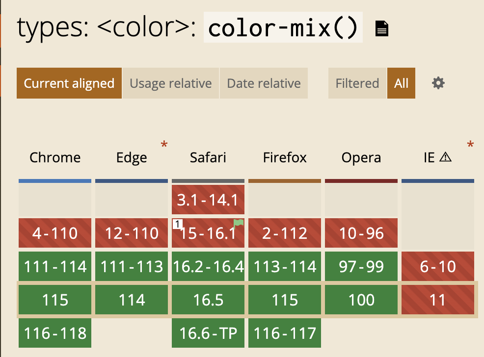

去年の段階で[CSS Color Module Level 5](https://www.w3.org/TR/css-color-5/)の仕様の中には `color-mix()`、`color()`、`device-cmyk()`、`color-contrast()`([CSS Color Module Level 6](https://drafts.csswg.org/css-color-6/)に移動し関数名は`contrast-color()` に変更)と、多くの色に関する新しい機能の検討がされていて、目にする度に _「んー、でも使い方よくわからない。デザイナーじゃないし」_ と、思っていました。

ただ、`color-mix()` に関してはむしろデザインが苦手なエンジニアほど使い勝手がいい機能だと思ったので紹介します。

## color-mix()紹介
そう思わせてもらえたのはこちらの動画
<iframe width="560" height="315" src="https://www.youtube.com/embed/dkBeBxs48os?start=695" title="YouTube video player" frameborder="0" allow="accelerometer; autoplay; clipboard-write; encrypted-media; gyroscope; picture-in-picture; web-share" allowfullscreen></iframe>

この動画をまだ見ていない人はぜひ見てほしい…

動画の中でまずは使い方について紹介されています。
```css
color-mix(in oklch, var(--color-1), var(--color-2));
```

_（`in oklch` ってなに…？まず単位がわからない…）_

でもとりあえず関数名からしても、第一引数が基準となる色空間、第二引数が1つ目の色、第三引数が2つ目の色を指定して、`mix` された色を取得できるんだろうな、ということだけはなんとなくわかります。

この段階でもまだ _「最終的にブラウザで表示される色を、わざわざCSSでブレンドされる色を計算して書く…そんな使い方いつするんだろう…」_ と思っている。というか最初に仕様を見たときからこの時まで思っていました。

## transparentを組み合わせる
その後の動画のスライド

```css
color-mix(in srgb, var(--color1), transparent var(--alpha-parcent));
```

_「あー、透明色として transparent も混ぜることができるのか。 ん、え？アルファ値渡せる…？」_

`color-mix()` は単純に2つの色をブレンドするだけでなく、それぞれどれくらいの濃度で合わせるか、パーセンテージも指定できます。

つまり…

```css
:root {
  --colorPrimary: #89b6dd;
  --colorPrimary-a10: color-mix(in srgb, var(--colorPrimary), transparent 90%);
  --colorPrimary-a20: color-mix(in srgb, var(--colorPrimary), transparent 80%);
  --colorPrimary-a30: color-mix(in srgb, var(--colorPrimary), transparent 70%);
  --colorPrimary-a40: color-mix(in srgb, var(--colorPrimary), transparent 60%);
  --colorPrimary-a50: color-mix(in srgb, var(--colorPrimary), transparent 50%);
  --colorPrimary-a60: color-mix(in srgb, var(--colorPrimary), transparent 40%);
  --colorPrimary-a70: color-mix(in srgb, var(--colorPrimary), transparent 30%);
  --colorPrimary-a80: color-mix(in srgb, var(--colorPrimary), transparent 20%);
  --colorPrimary-a90: color-mix(in srgb, var(--colorPrimary), transparent 10%);
}
```

**こうなる**(動画のサンプルコードそのまま)。

自分のようなデザインセンスが皆無のような人にとってはこれが非常に使い勝手がよくて、`PrimaryColor`を一つだけ決めればいいのはストレスがない。`--colorPrimary-dark`,`--colorPrimary-light`とかわざわざ用意したりしなくていい。

ところでクロスブラウザ対応ですが、このようになっています。


主要ブラウザでは使えるのでどんどん使っていきましょう。

## カスタムプロパティを動的にわたす
おまけとしてHTML側からカスタムプロパティを渡す方法を紹介します。
（ダイナミックスタイルと呼んでいるのも見たことあるけど、なんか名称ついてるんでしょうか。）

とにかく、カスタムプロパティ（CSS変数）を動的に渡して `color-mix()`を使ってみます。

<iframe src="https://codesandbox.io/embed/color-mix-5tys4v?fontsize=14&hidenavigation=1&theme=dark"
     style="width:100%; height:500px; border:0; border-radius: 4px; overflow:hidden;"
     title="color-mix"
     allow="accelerometer; ambient-light-sensor; camera; encrypted-media; geolocation; gyroscope; hid; microphone; midi; payment; usb; vr; xr-spatial-tracking"
     sandbox="allow-forms allow-modals allow-popups allow-presentation allow-same-origin allow-scripts"
   ></iframe>

これがPureCSSのみでできているのが感動なんですが、伝わってますか…？？

### コード
```html
<div class="boxes">
  <div class="box" style="--alpha-parcent: 20%;">box1</div>
  <div class="box" style="--alpha-parcent: 40%;">box2</div>
  <div class="box" style="--alpha-parcent: 60%;">box3</div>
  <div class="box" style="--alpha-parcent: 80%;">box4</div>
</div>
```
```css
:root {
  --colorPrimary: blue;
}

.boxes {
  display: grid;
  grid-template-columns: repeat(2, 1fr);
  grid-template-rows: 100px 100px;
}

.box {
  background-color: color-mix(
    in srgb,
    var(--colorPrimary),
    transparent var(--alpha-parcent)
  );
}
```

## まとめ

色関連の機能がどんどん実装されていくのは見てたんですけど、いつも _「使い方わからん」_ でした。  
しかし `color-mix()` はすごい使えそうで感動したので紹介しました。（設計やメンテンナンス性の課題はある）

CSSの新機能は、色関連だけでなく `View Transitions` や `Scroll-driven Animations` といったアニメーション関連も結構充実してきているイメージがあります。（三角関数も間接的に）

実際どれも実務でも、個人開発でも使う機会ほぼなかったりますが、やはり新しい機能はわくわくするし、いつでも出せるように武器は増やしておきたいです。
