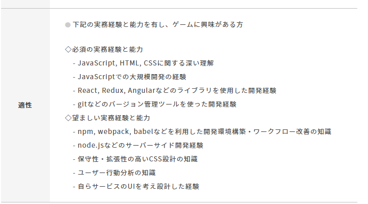

# 少しずつでも目標に向かって進もう

HTML と CSS は毎日書いてるのでよしとしよう。
問題は JavaScript だ。JavaScript は本を２冊くらい読んだはいいが、実践ではほぼ使っておらず、実際の業務では jQuery に頼ってる部分が大きい。そして React にいたっては任天堂の求人で初めて存在を知ったレベル。
どうしようかなぁ、ととりあえず React を調べていると note にたどり着いた。

[https://note.com/erukiti/n/ne2a4eaafcf72?magazine_key=m586c4ddc9ee1](https://note.com/erukiti/n/ne2a4eaafcf72?magazine_key=m586c4ddc9ee1)

女子高生でも React 頑張ってるんだからおれだって頑張れるな（）。とやる気が出たところで、一通りこの方の note を読み漁っていると VSCode が大好きとのことで、これも広いネットの海で巡り合った縁だし、他にも技術的な発信をよく行っているので、一旦彼の用意してくれた道を歩かせてもらおうと思い、VSCode を導入。（実際は以前インストールしていたが使っていない）

と、同時に Dreamweaver と別れを告げる時が来たのかもしれない。調べると DW でできることは大概は VSCode でできるようだし、移行を真剣に考えよう。
