**_注意：この記事はよくわからないまま進めているポイントがありますが、詰まった部分もあえて共有する目的で公開しています。_**

[https://note.com/erukiti/n/nc716e70fa9a1?magazine_key=m586c4ddc9ee1](https://note.com/erukiti/n/nc716e70fa9a1?magazine_key=m586c4ddc9ee1)

[前回の記事](https://totolog34.com/141/)の続きになりますが、完全にこちらの記事に沿って学んでいくことにしました。

## Nodist をインストールする

### 最新版の Nodist をダウンロード
[https://github.com/nullivex/nodist/releases](https://github.com/nullivex/nodist/releases)から最新版の exe ファイルをダウンロードします。

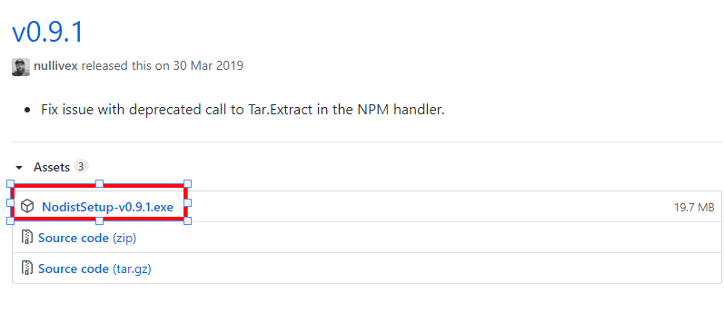

**NodistSetup-v0.9.1.exe**をダウンロードします。

### Nodist をインストール

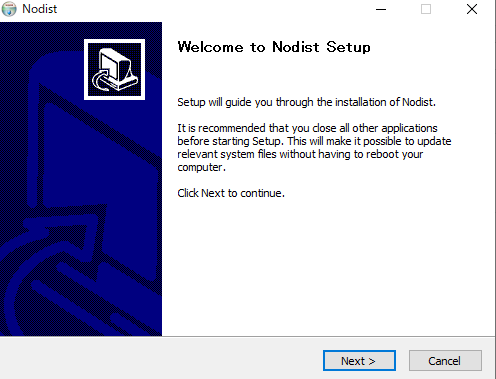

**Next**

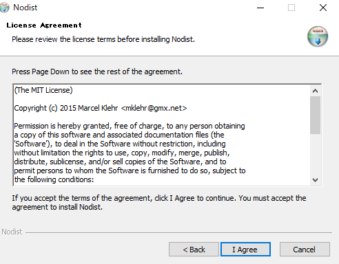

**I Agree**

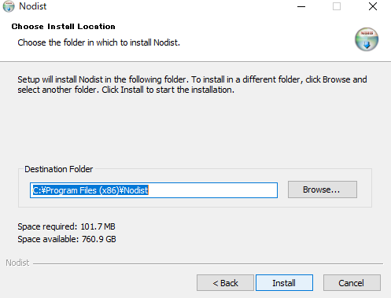

**Install**

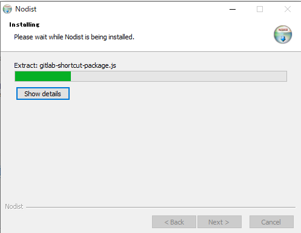

待ちます

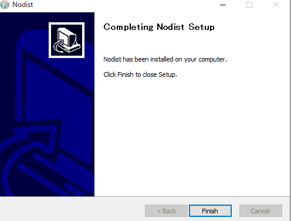

Finish

### Nodist を使って Node.js をインストール

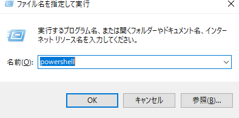

Windows + R で「ファイル名を指定して実行」を開いて「powershell」を実行し、「nodist」を入力します。

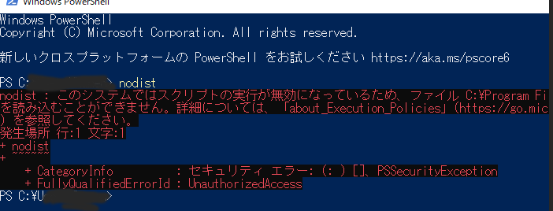

エラーが出る時は PowerShell を管理者実行する必要があります。

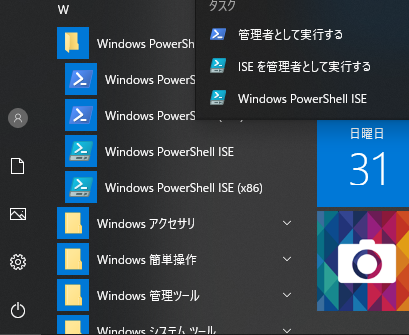

**「スタートメニュー」**→**「Windows PowerShell」**→**「Windows PowerShell」**を右クリック→**「管理者として実行する」**

```
Set-ExecutionPolicy Unrestricted
```

**Windows PowerShell**が起動したら上記のコマンドを入力します。

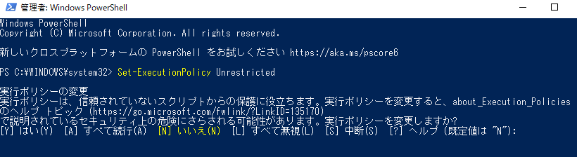

“Y”を入力し（小文字のyでもいい)、Enterを押します。

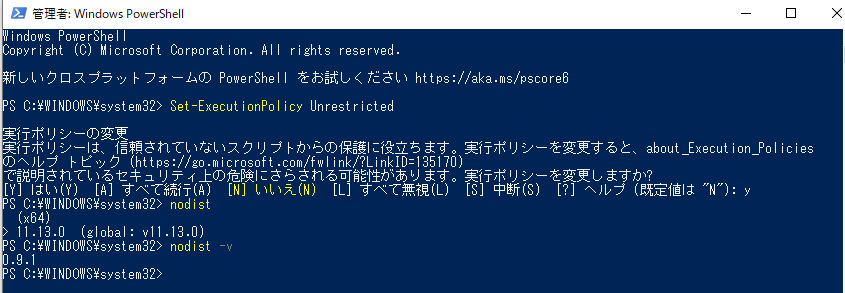

Nodist が動くようになりました。

## Node.js の安定版（LTS）をインストールする

**注意：ここからがよくわからないポイント**

[リリース計画](https://github.com/nodejs/Release)から LTS のバージョンを確認します。

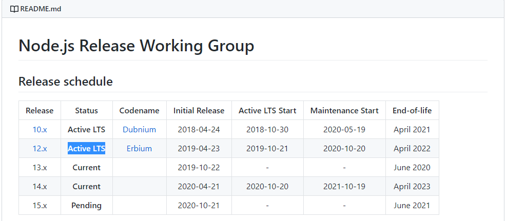

10.xと12.xのStatusはLTSなので、上記の場合12.xになります。Currentは最新版ですが、少し不安定かもしれないバージョンなのでLTSを選択しておくのが確実です。

### PowerShell で LTS をインストール

LTS は 12.x なので「nodist + 12」を入力しインストールします。

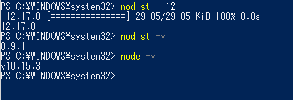

これで、LTS のバージョン 12 がインストールできまし...ん？

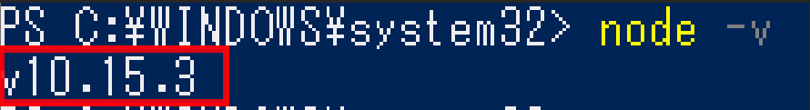

v10.15.3・・・？12じゃない・・・？

### うまくいかないのであれこれ試す

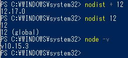

nodist +12で最新版をインストールして、

nodist 12でバージョン12を動くようにして、

node -vでバージョンを確認すると、10！！！

**なんでやねん！！！**

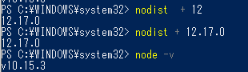

12 の最新版じゃなくて、バージョンを完全に指定してみるもダメ。
あ、そうか。v をつけないといけないのかなｗ？

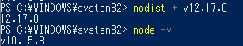

違う、そうじゃない。（らしい）
何度やっても 12 が動かない。。。
えー、なんでだ。。。

### 解決策

結論：わかりませんでした。

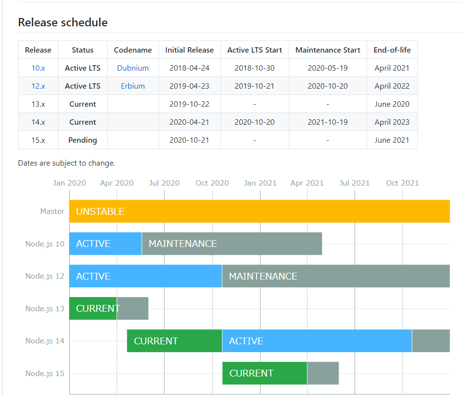

ある程度は調べてみましたが、リリース計画見ると 10 は Active だし、動作に問題なさそうだし、ここで調べる時間を割いてももったいないという判断で切り上げます！
