# Contentful のアカウント登録方法

## Contentful アカウント登録手順

[Contentful](https://www.contentful.com/)のページへアクセスし「Get started」をクリック

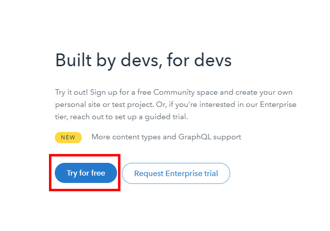

「Try for free」をクリック

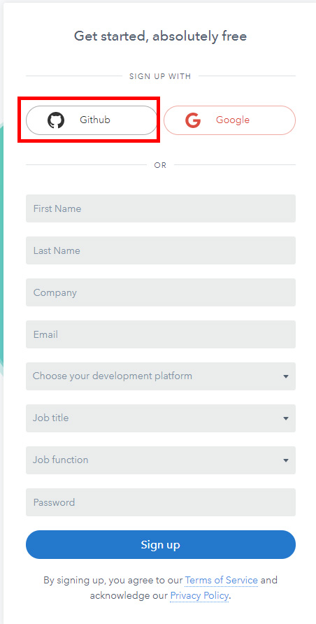

Githubを選びます。

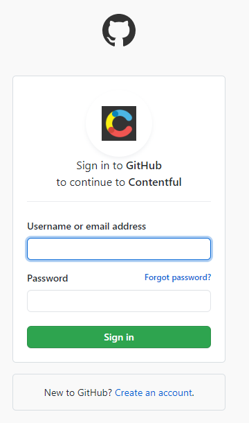

ログインを求められたら、ID とパスワードを入力して、サインインします。

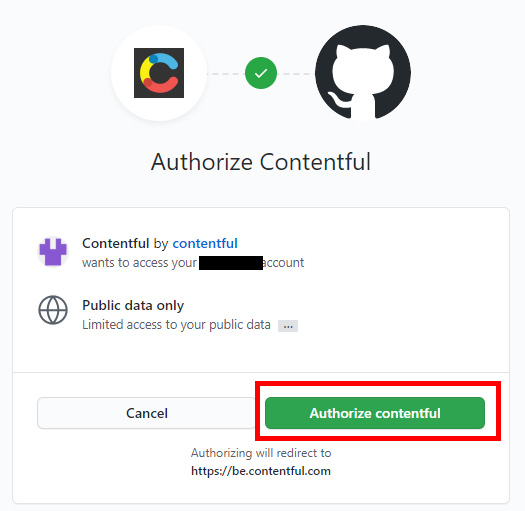

Authorize contentfulをクリックします。

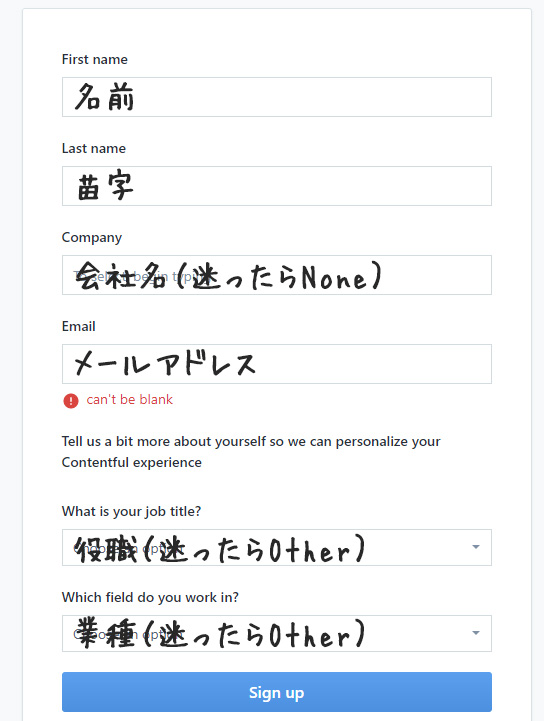

アカウント情報を登録します。

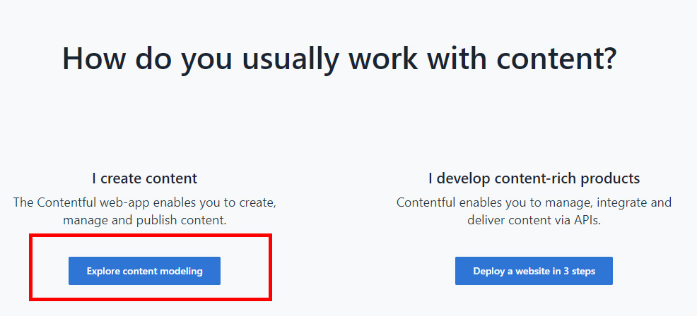

Explore content modelingをクリックします。
その後少し待ちます。

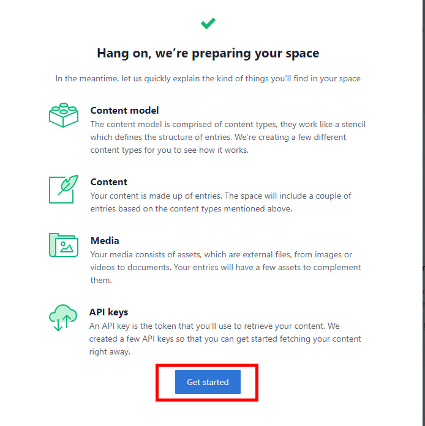

Get Startedをクリックします。

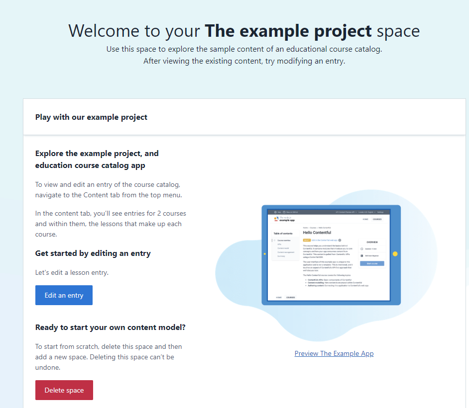

管理画面が表示されるのでこれで登録完了です。

## スペースの作成

無料で作成できるスペースは２つまでという情報を見たことある方もいるかもしれませんが、2020-08-07現在、無料スペースは１つまでです。

アカウント登録時に自動でスペースが作成されるので、そのまま使うか、一旦スペースを削除して作成し直す必要があります。

### アカウント登録時に作成されたスペースを削除

左上のThe example projectをクリック

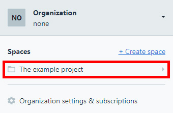

The example projectをクリック

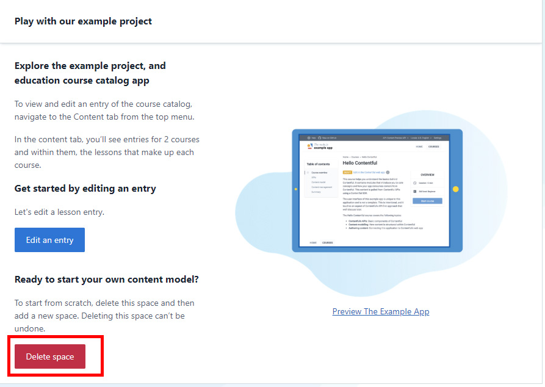

Delete spaceをクリック

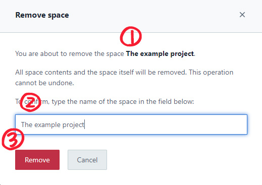

太文字の①The example projectをコピー（ドットまでコピーしないように）して②テキストボックスに貼り付けて、③Removeをクリックします。

### スペースを作成

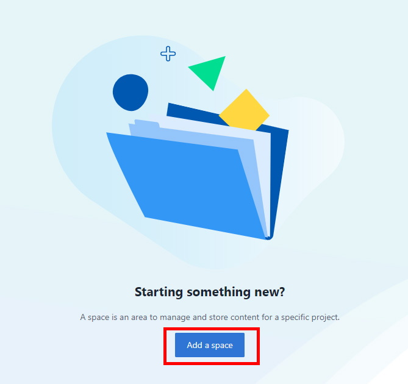

左上の**Welcome to Contentful**をクリックするか、管理画面TOPの**Add a space**をクリックします。

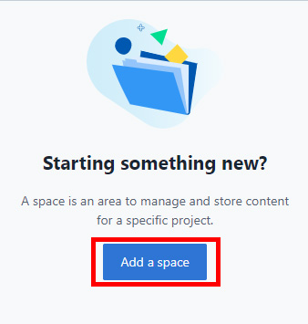

**Welcome to Contentful**の場合はさらに**Add a space**をクリック。

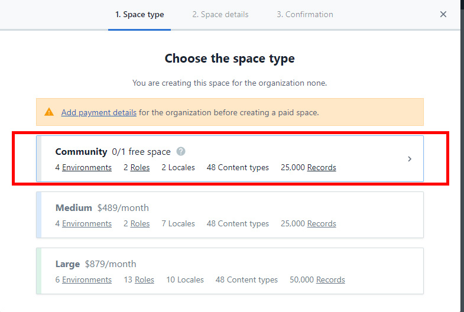

Communityをクリック

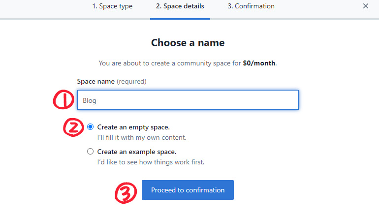

①スペース名を入力し、空のスペースを作成するので、②Create an empty space.を選択し③Proceed to confirmationをクリック。

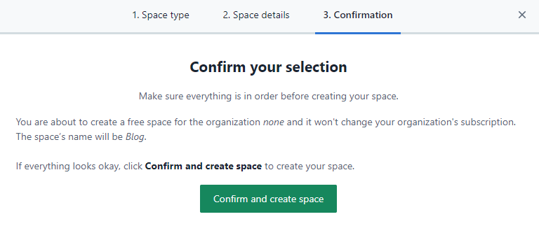

Confirm and create spaceをクリック

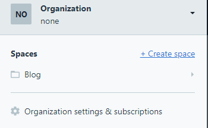

スペースの作成ができました。

## ロケールの設定

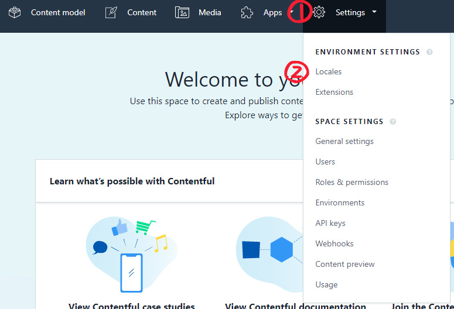

①Settings→②Localesをクリック

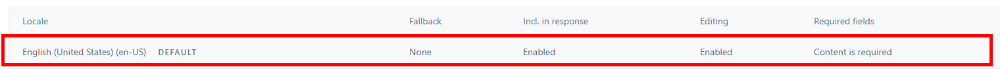

表示されている Locale をクリック

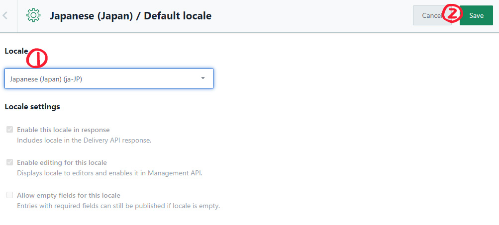

Localを①プルダウンの中からJapanese(japan)(js-JP)を選択し、②Saveをクリック。

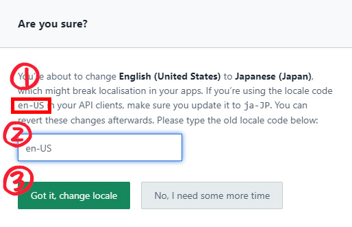

①変更前のロケールを②テキストボックスに入力し、③Got it, change localeをクリック

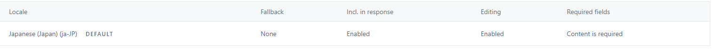

DEFAULT が変更されていれば変更完了です。
