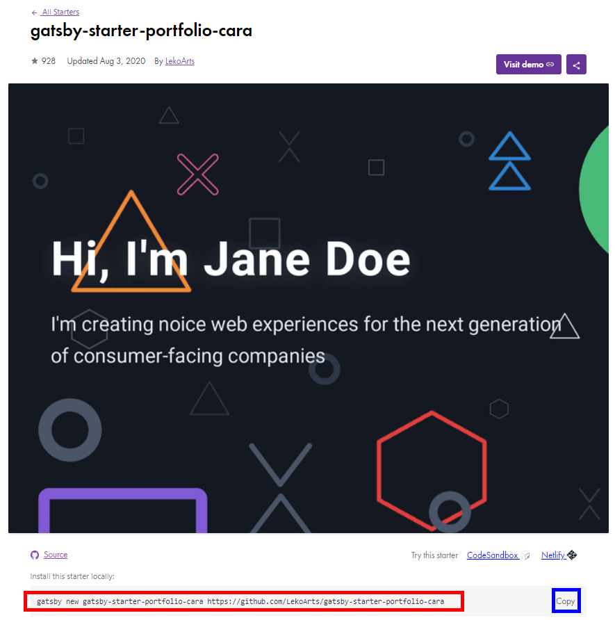
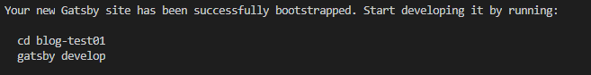
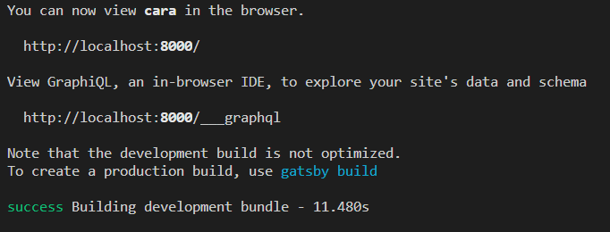
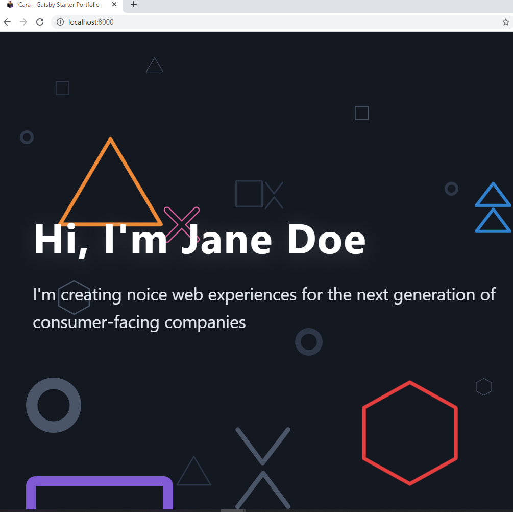

# 【gatsby.js】いい感じの Starter でサイトを作り始める

gatsby.js でスターターをいろんなスターターを利用してみます。なお、今回は CMS を使用している Starter は避けておきます。なぜならエラーが出るからです。

## スターターを探す

[https://www.gatsbyjs.org/starters/?v=2](https://www.gatsbyjs.org/starters/?v=2)

カテゴリでわかれて検索もできるので自分のイメージや好み、目的にあったものを探します。

## スターターをダウンロードする



赤枠のコードか青枠のボタンをクリックしてコードをコピーします。
そのままターミナルに貼り付けてもよいですが、ディレクトリを指定したい場合は予め変更しておきます。

```
gatsby new gatsby-starter-portfolio-cara https://github.com/LekoArts/gatsby-starter-portfolio-cara
⇓
gatsby new blog-test01 https://github.com/LekoArts/gatsby-starter-portfolio-cara
```

### ダウンロード完了



無事ダウンロードが完了したらディレクトリに移動して(cd blog-test01)、ビルド(gatsby develop)してみます。



ビルドが完了したらブラウザでhttp\://localhost:8000/にアクセスします。



**表示できました！**
