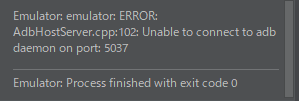
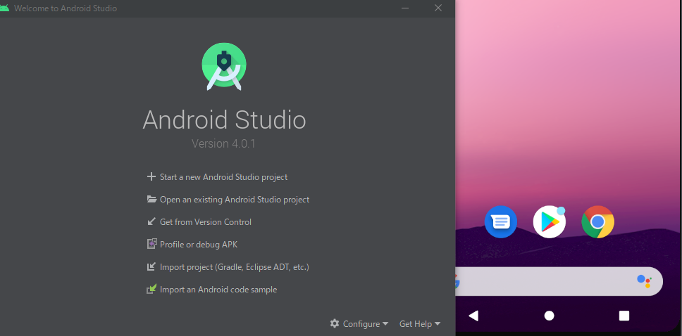
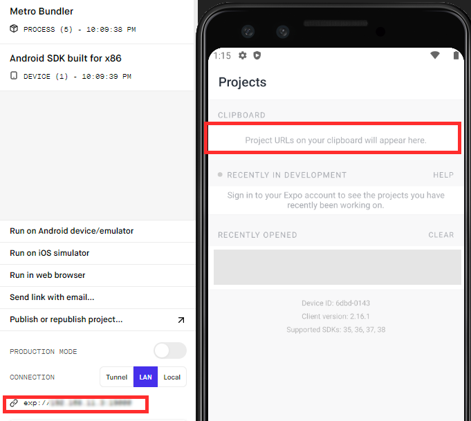
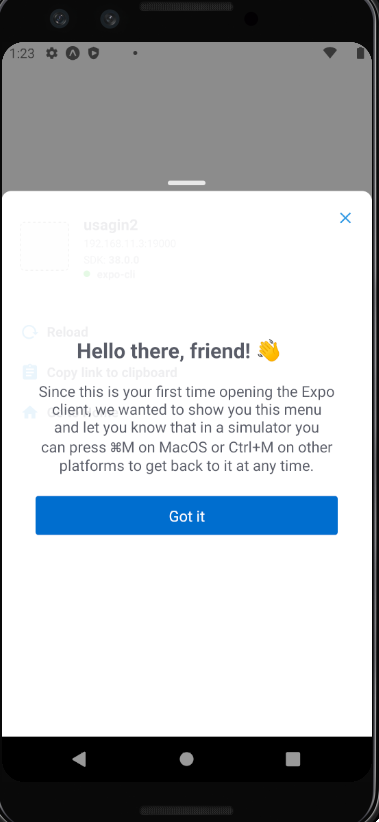

# React Native + Expo で始めたら PC がクラッシュし続けた

npm start もしくは expo start を実行すると１００％の確率でモニターがブラックアウト。PC がフリーズ。強制的に電源を落として再起動するしかなくなった。

## 環境紹介

- Windows10
- wsl
- Visual Studio Code
- Android Studio

### どんな経緯をたどったか

expo init でプロジェクト作成。npm start を行うとブラウザで Expo Developer Tools が表示される。そしてその後クラッシュする。以前ためしに公式の手順に従って以前プロジェクトを作成していたことがクラッシュの原因。

## エラーの内容１（Couldn't start project on Android: Error running adb）


```
Couldn't start project on Android: Error running adb: No Android connected device found, and no emulators could be started automatically.
Please connect a device or create an emulator (https://docs.expo.io/versions/latest/workflow/android-studio-emulator).
Then follow the instructions here to enable USB debugging:
https://developer.android.com/studio/run/device.html#developer-device-options. If you are using Genymotion go to Settings -> ADB, select "Use custom Android SDK tools", and point it at your Android SDK directory.
```

とりあえず[リンク先](https://docs.expo.io/workflow/android-studio-emulator/?redirected)を確認してみる。


「adb システムに複数のバージョンがあると、エラーが発生する可能性があります」らしい。

### エラー解決手順

そのまま紹介されている手順通りにすすめる。

### ターミナルから adb システムのバージョンを確認する

<p class="is-style-blank-box-blue">$adb version


<p class="is-style-ng-box">Command 'adb' not found, but can be installed with:
sudo apt install adb
コマンドが使えないのでadbを「sudo apt install adb」でインストールする。
インストールできたら再度adb versionをたたく。


無事表示された

### ディレクトリをコピーする

<p class="is-style-blank-box-blue">cd ~/Android/sdk/platform-tools
## エラーの内容２（Unable to connect to adb daemon on port:5037）

Android Studio から AMD Manager でエミュレーターを起動してみる。

<figcaption>
</figcaption>

### adb サービスを再起動する

<p class="is-style-ng-box">AdbHostServer,cpp:102: Unable to connect to adb daemon on port:5037
ポート：5037が使えない・・・？のでadbサービスを再起動する。
<p class="is-style-blank-box-blue">adb kill-server
<p class="is-style-ng-box">cannot connect to daemon at tcp:5037: Connection refused
エラーが出てしまったので管理者実行する。
<p class="is-style-blank-box-blue">sudo adb kill-server


再起動できた。
Android Studio から AVD Manager でエミュレーターを再度起動する。



エラーが消えたことを確認できたので、ここでようやくRun on Android device/emulatorをしてみる。


エラーがでてると思いきや、エミュレーターで USB debugging を聞かれているのでAllowを選択する。
そしてもう一度ブラウザのRun on Android device/emulator**をクリックする


ようやくこれでビルドが完了しました！！！

## おまけ：うまくエミュレーターが動いてない

エミュレーターを下から上へスワイプするとメニュー画面が出るので、Expoをクリック（タップ）



ブラウザの**Expo Developer Tools**にある URL をエミュレーターの入力欄にコピペする。



表示できた！
