# WEB フォントの使い方＜サーバー、Adobe、Google ＞

WEB フォントの使い方について説明します。画像が多めの説明です。

## サーバーに直接フォントをアップロード

### フォントを準備する

まず使いたいフォントをローカルで用意します。

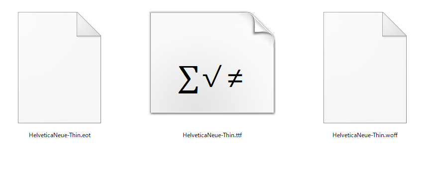

必要ならばコンバーターを使用して変換もします。

[https://convertio.co/ja/font-converter/](https://convertio.co/ja/font-converter/)

準備ができたら[FFFTP](https://forest.watch.impress.co.jp/library/software/ffftp/)等でサーバーにアップロードします。

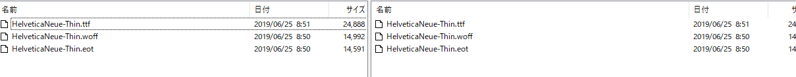

### CSS の記述

```css
@font-face {
  font-family: 'HelveticaNeue';
  src: url('font/HelveticaNeue-Thin.eot'); /* IE9 Compat Modes */
  src: url('font/HelveticaNeue-Thin.eot?#iefix') format('embedded-opentype'), /* IE6-IE8 */
      url('font/HelveticaNeue-Thin.woff') format('woff'),
    /* Modern Browsers */ url('font/HelveticaNeue-Thin.ttf') format('truetype'); /* Safari, Android, iOS */
}

.txt {
  font-family: 'HelveticaNeue';
}
```

あらかじめ宣言しておいて、適用させたい部分で font-family で設定した名称を設定します。

## Adobe Fonts（有料）

[https://fonts.adobe.com/my_fonts](https://fonts.adobe.com/my_fonts)

Adobe CC に加入していると Adobe Fonts を無料で利用できます。
今回は私の普段の使い方を例に説明します。

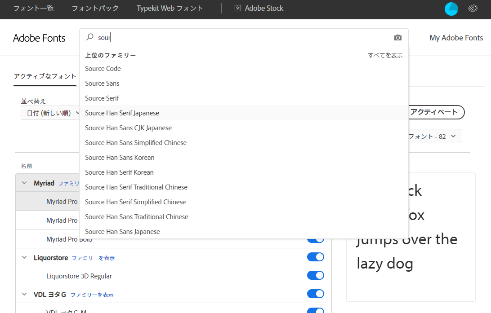

使用したいフォントを選びます。


「Web プロジェクトに追加」します。


「新規プロジェクトを作成」を 選択するとプロジェクト名を入力できるようになるので、入力します。


種類が多い場合は「＋さらに５個を表示」をクリックします。

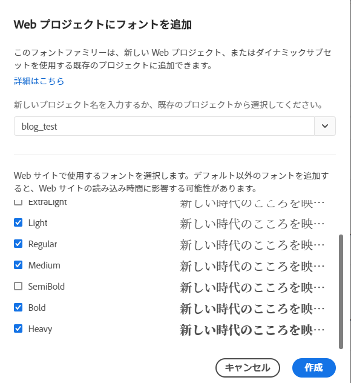

使用するフォントを選んだら作成します。

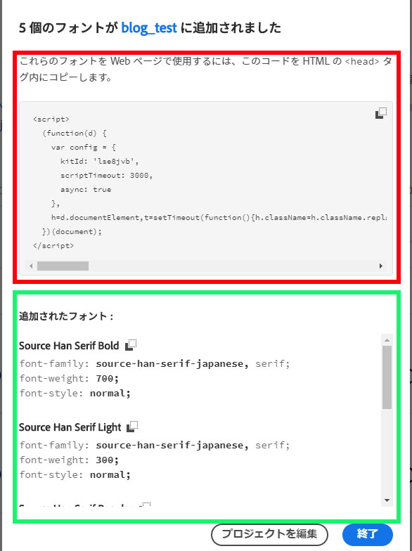

\<script\>タグはコピーして\<head\>に貼り付けます。

```css
.medium {
  font-family: source-han-serif-japanese, serif;
  font-weight: 500;
  font-style: normal;
}
```

あとはフォントを適用したい部分で CSS をそのまま貼り付けます。

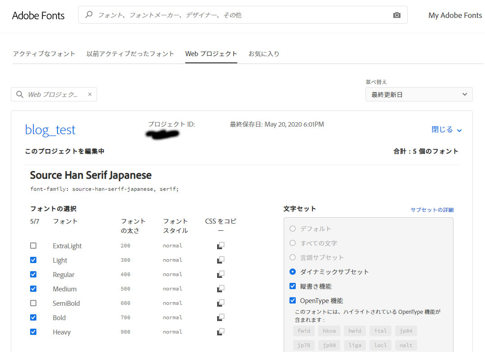

もしも CSS を忘れてしまったら、
「My Adobe Fonts」→「Web プロジェクト」→「プロジェクトを編集」を選ぶと上記の画面になるので、「CSS をコピー」でいける。

## Google Fonts（無料）

まずは[Google Fonts](https://fonts.google.com/)のサイトへいきます。

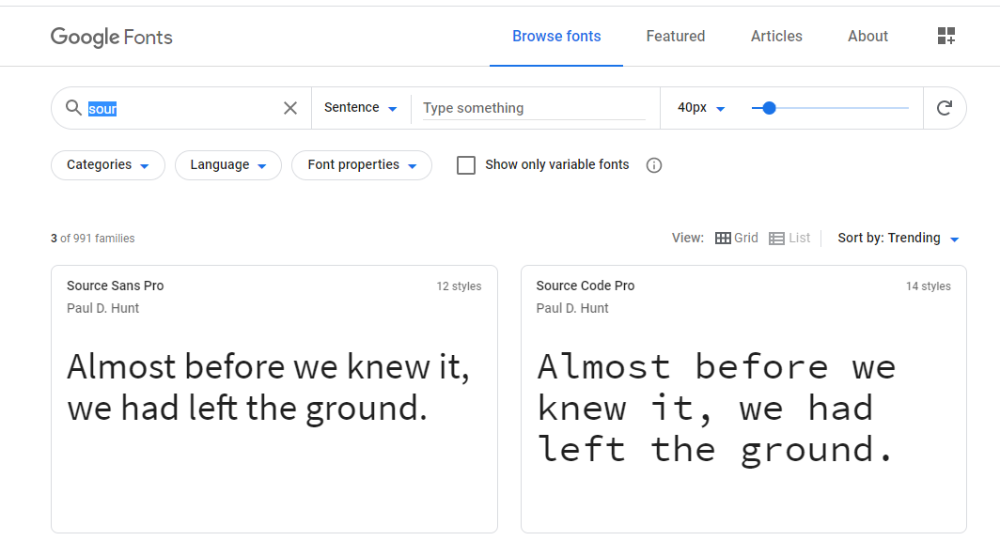

検索ボックスで使用したいフォントを探します。

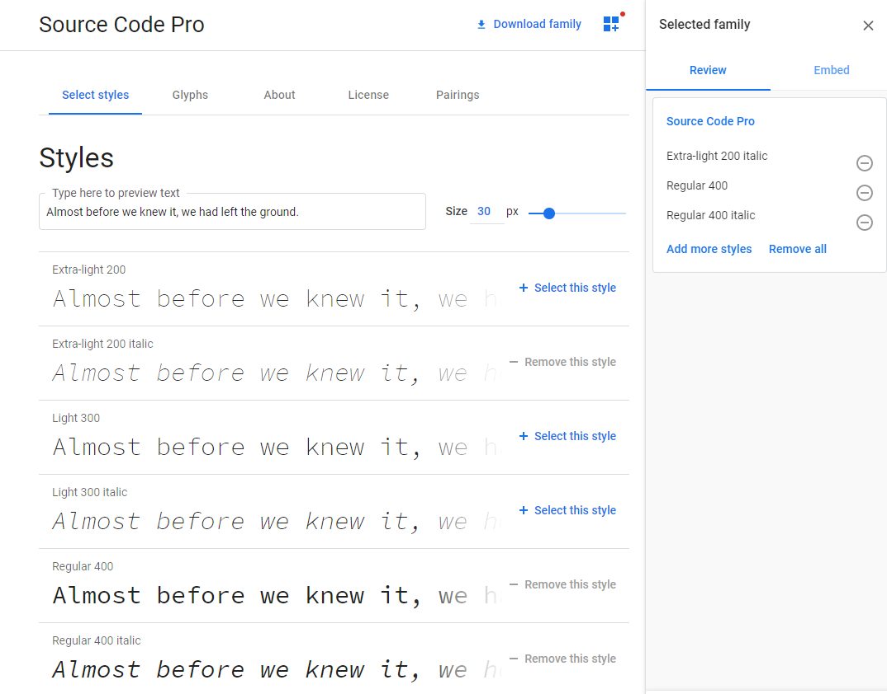

使いたいフォントを片っ端から「+ Select this style」します。
もちろん複数のフォントも選べます。

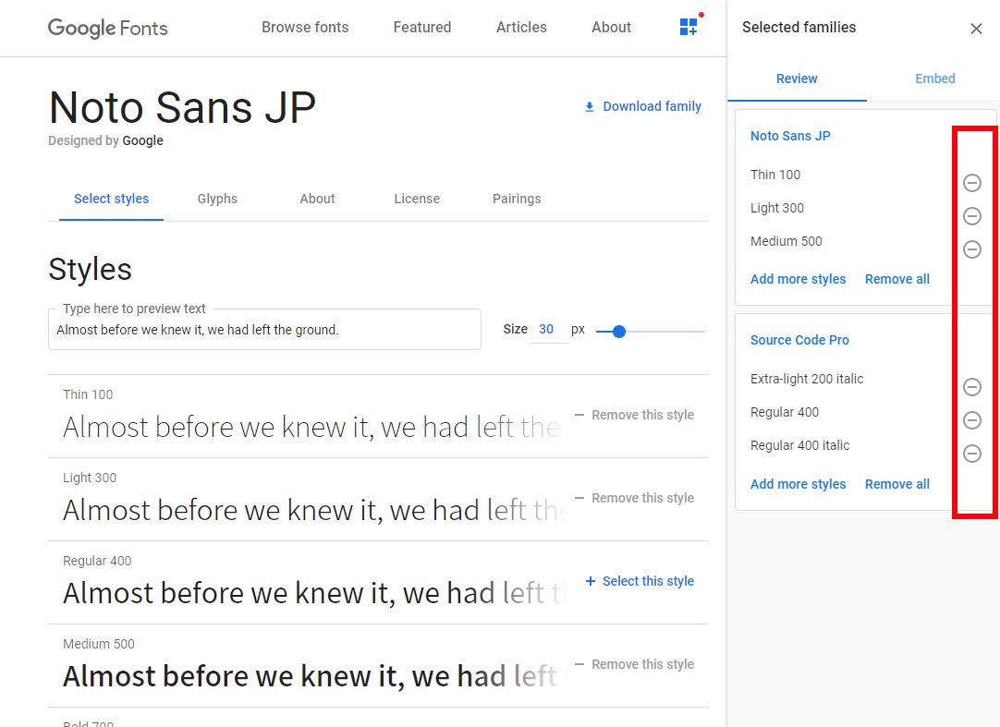

しかし選び過ぎには注意です。読み込みデータがその分重くなってしまいます。
選んだ後に「必要ないな」となった時は「－」で削除します。

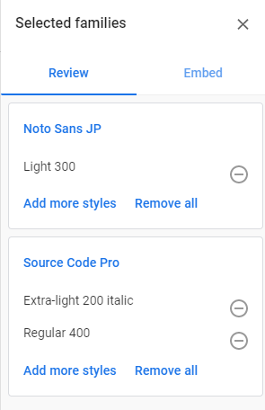

使用するフォントを選んだら「Embed」を選択します。

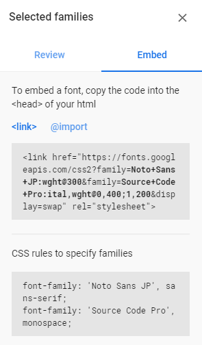

\<link\>タグは\<head\>タグ内に貼り付けます。

```css
.noto {
  font-family: 'Noto Sans JP', sans-serif;
  font-weight: 400;
}

.ex-light {
  font-family: 'Source Code Pro', monospace;
  font-weight: 200;
  font-style: italic;
}
```

CSS もそのまま貼り付けますが、斜体や太さなどは追加で記述します。

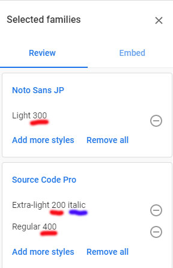

数値等は Review の部分を見れば簡単にわかります。
