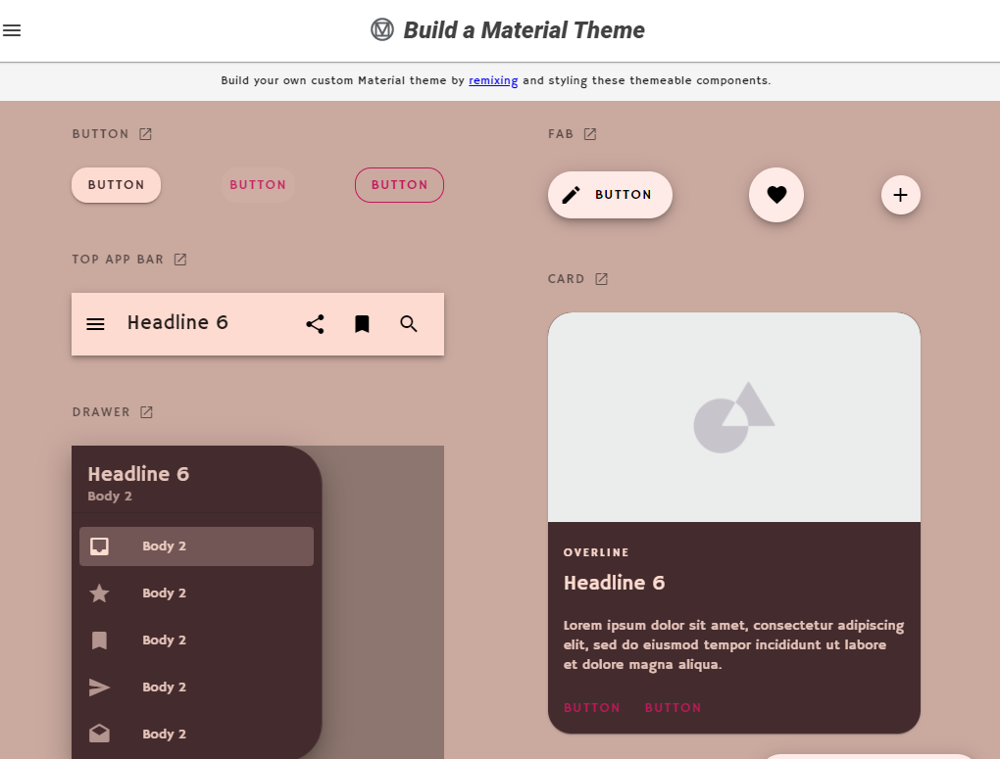

現在プログラミングの学習としては JavaScript ばかりをしているけれど、React もモチベーション維持で触りたい、ということで React Native をさわることにした。

## Expo をつかう

React Native Cli でもできますが、Expo にしました。公式も Expo Cli を推奨しています。

> **If you are new to mobile development**, the easiest way to get started is with Expo CLI.[https://reactnative.dev/docs/environment-setup](https://reactnative.dev/docs/environment-setup)

なんで Expo がいいのかはこちらの動画がわかりやすいです。

## React Native Paper をつかう

[React Native Paper](https://reactnativepaper.com)は React でいう Material UI で Google のマテリアルデザインを React Native 用にカスタマイズしたコンポーネントのコレクションです。
デザイン力が皆無なので利用を決めました。

## Glitch をつかう

<figcaption>ここまで作ってだいぶイメージわくようになった</figcaption>

デザイン力が思った以上に無さすぎて、Material Desigin のサイトを眺めていたら、Build a Material Theme を知り、[Glitch](https://glitch.com/)というサービスを使うことにしました

[https://material.io/resources/build-a-material-theme](https://material.io/resources/build-a-material-theme)

Glitch については[こちらのページ](https://laboradian.com/glitch/)で詳しく紹介されています。

## React Navigation をつかう

React Native Paper でデザイン部分を頼っても、画面遷移ってどうすればいいんだ・・・ということに気づきました。React Native の画面遷移のライブラリはいくつかありますが、[React Navigation](https://reactnavigation.org/)を使うことにしました。
詳しくは[こちらのサイト](https://codezine.jp/article/detail/12150)で紹介されています。というより今から React Native 始めるって方はこの連載は全部目を通して損はないと思います。

[https://codezine.jp/article/corner/772](https://codezine.jp/article/corner/772)

ここまできてようやく開発のスタート地点に立てた気がします…（たっててほしい）
