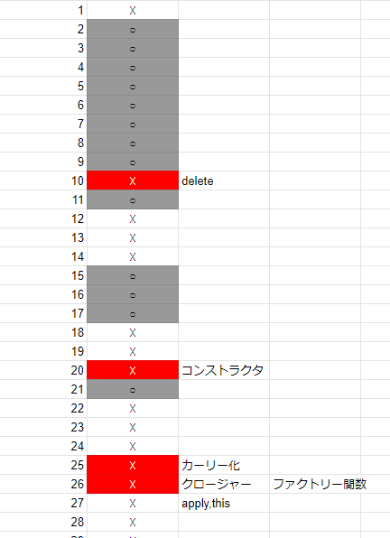

# React 学習状況 ⑤

[前回から](https://totolog34.com/220/)

## React

React は最近ちょくちょく投稿しているけれど、React Native をさわっている。情報も React に比べて全然なくて、海外の youtube の動画ばかり見ている。あと公式ドキュメント。毎日少しずつ進めてリリースまでたどり着きたい。
Udemy で購入した Hooks もまったく手つかずなので同時進行で今学習しておきたいところ。
ちなみに、実は Gatsby.js で LP っぽいサイトを爆速で製作した。試しに作りたかったという理由だけだったから、スターターから内容調整してデザイン少しいじって１日もかかってない。あまりにも時間をかけてなくて達成感もなく身になってる気もしない。ただ「できるんだな」という知識だけ増えた。

## JavaScript

合言葉は毎日 JavaScript。
学習方法が完全に定まった。１は隙間時間に。２～４はちゃんと時間をとって集中してやっている。

### １．書籍

[https://twitter.com/dir20634/status/1295149950594977792](https://twitter.com/dir20634/status/1295149950594977792)

まず、Twitter の書籍プレゼントが当選した。めちゃくちゃありがたい…本当にありがとうございました！常にかばんの中に入っていて、移動中やちょっとした休憩、少しでも時間ができれば開いて読んでいる。

### ２．問題集として
もりけんさんの[JavaScript問題集](https://gist.github.com/kenmori/1961ce0140dc3307a0e641c8dde6701d)。

全部で４００問近い数。何度も繰り返してすんなりできるまでやる。テスト勉強みたいな学習方法

### ３．参考書（辞書）として

みんな大好き[MDN](https://developer.mozilla.org/ja/)。

問題集の答えを丸暗記しても意味がないので、構文などを逐一調べて理解する。

### ４．教科書として

[JavaScript Primer](https://jsprimer.net/)

書籍も発売されているけど無料で全て閲覧可能

[https://www.amazon.co.jp/dp/4048930737/](https://www.amazon.co.jp/dp/4048930737/)

問題集の予習、復習にしっかり読みすすめる。検索機能もめちゃくちゃ便利。問題集で出てきた、例えばクロージャーとか this とか、検索ですぐ出てきて読める。ストレス感じない学習。

## あとがき

個人的に JavaScript の２～４の学習方法は本当におすすめ。しっかり理解しながら進めている実感がある。

チェックしながら覚えるまで無限にやってる。完全に無料でこれだけ学習できるのは本当にありがたい。
今後は TypeScript を（また）学習して、JavaScript が今問題集ベースだけど、機能ベースでコードをかけるようにする。そのためには急がず理解していく。
ちなみに今後やろうと思ってるのはこちら、という動画だけ紹介しておきます。これも無料で見れるのはありがたい。。。

