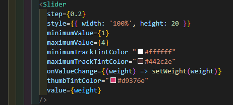
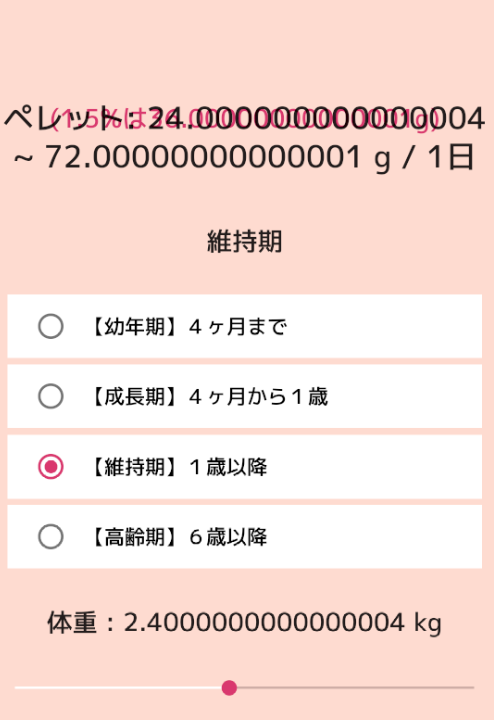
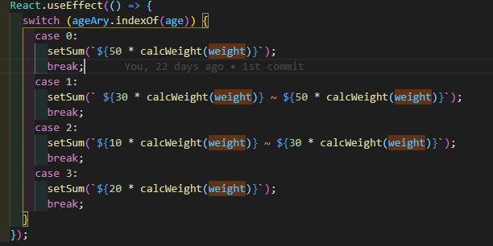
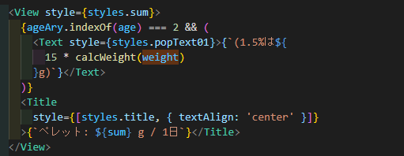
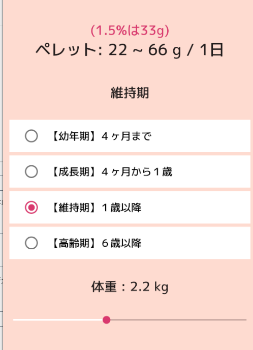
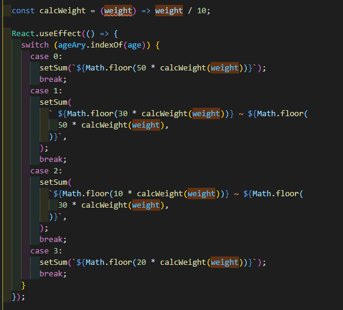

そもそも浮動小数点の問題は多分これです。

[https://stackoverflow.com/questions/2100490/floating-point-inaccuracy-examples/2100502#2100502](https://stackoverflow.com/questions/2100490/floating-point-inaccuracy-examples/2100502#2100502)

## Slider の設定を確認する



```jsx
<Slider
step={0.2}
minimumValue={1}
maximumValue={4}
minimumTrackTintColor="#ffffff"
maximumTrackTintColor="#442c2e"
onValueChange={(weight) => setWeight(weight)}
thumbTintColor="#d9376e"
value={weight}
/>
```



## setWeight のタイミングで調整してみる

制作したアプリでは weight を複数箇所で使用している。それならば、基準値を自然数にして、setWeight のタイミングで計算してしまえばよい…かと思えばそう単純ではない。
例えば次のようにコードを変更するとする。

```jsx
step={2}
minimumValue={10}
maximumValue={40}
{(weight) => setWeight(weight/10)}
```

すると表示は確かに小数点第一位となるが、毎回 weight がレンダリングされ、weight の数値と紐付いているスライダーの表記がおかしくなってしまう。

## 関数を用意して調整する

関数を用意して表示するタイミングでの調整を試す。

```javascript
const calcWeight = (weight) => weight / 10
```

weight で呼び出していたところを関数呼び出しに変更





weightの部分をcalcWeight(weight)に書き換えた。



想定通りの表示を実現することができた。

## Math.floor を使用する

解決できたとおもわれたがしぶとく残っていた。


Math.floor をつけて制御する。



きっともっとスマートな解決法はあると思うけれど、一旦は解決した。解決はしたが、全てに Math.floor をつけるという、力技のように思えるので、またリファクタリングすることにする。
