# 【WordPress】スパム対策に特化したプラグインを入れてみよう

今回入れるプラグインは３つです。

- Akismet Anti-Spam
- Wordfence Security
- SiteGuard WP Plugin

## Akismet Anti-Spam

WordPress をインストールすると最初からインストールされている Akismet ですが、無料の範囲内でできるとこまで設定します。

### **Akismet**のアカウントを設定する

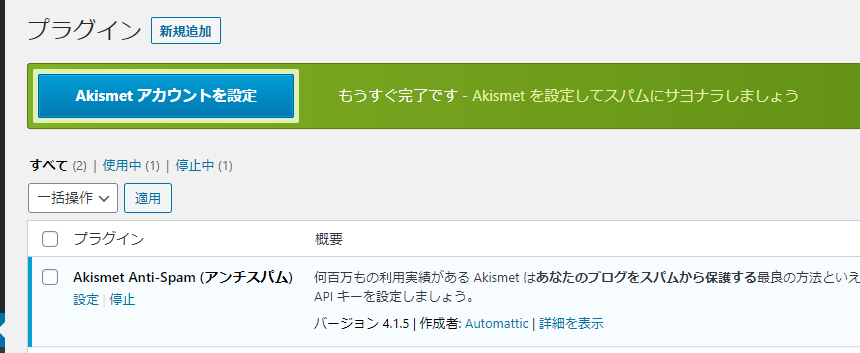

プラグインの画面で大きく目立つアカウント設定ボタンがあるのでクリック。

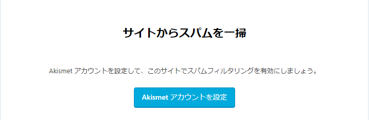

そのまま「Akismet アカウントを設定」へ進みます。

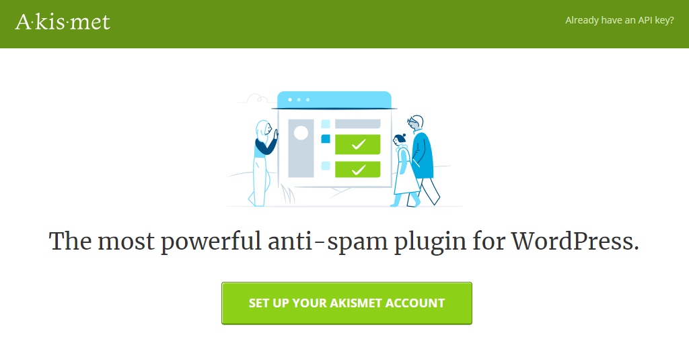

「SET UP YOUR AKISMET ACCOUNT」をクリック

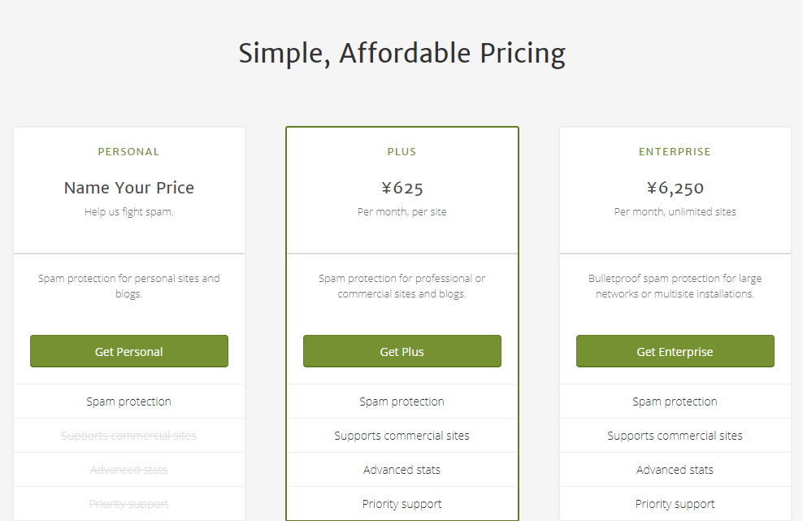

「Get Personal」をクリック

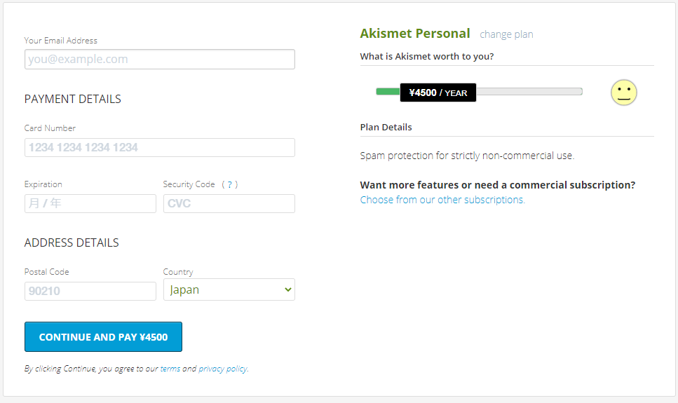

右側の金額のスライダーを￥０に動かします。

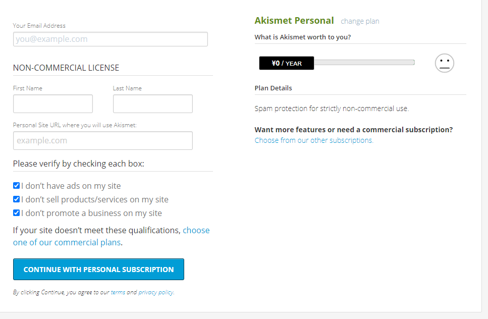

#### Your Email Address

認証コードが届きますのでメールアドレスを設定

#### First Name 　/　 Last Name

名前を入力

#### Personal Site URL where you will use Akismet:

今回 Akismet を登録するサイトの URL を設定

#### ３つのチェックボックス

全てにチェックを入れます。入れないと登録できません。もしもチェック項目に該当する場合は有料の商用プランを選択する必要があります。

- I don’t have ads on my site ＝ サイトに広告がない
- I don’t sell products/services on my site ＝ サイトで商品やサービスを販売していない
- I don’t promote a business on my site ＝ サイトでビジネスの宣伝をしていない

全ての項目が記入できたら「CONTINUE WITH PERSONAL SUBSCRIPTION」をクリックします。

### 認証コード入力

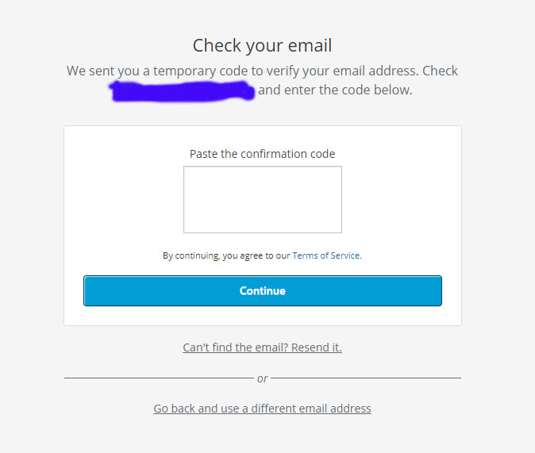

上記の画面に遷移したら先程入力したメール BOX を開きます。

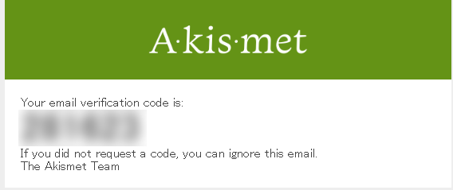

届いたメールに書いてあるコードを入力します。

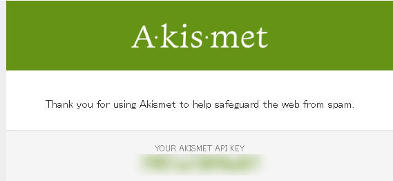

メール BOX を更新すると API KEY が届いています。

### WordPress 側に API KEY を設定

ここまできてようやく WordPress の管理画面に戻ります。

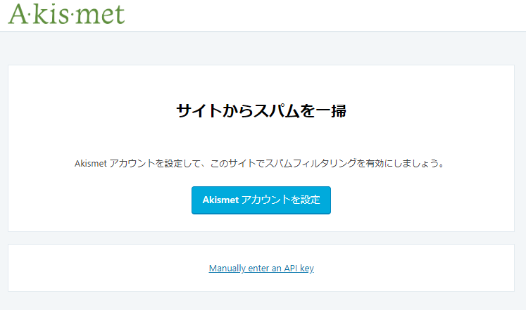

Manually enter an API keyをクリックし、先程の API KEY を入力します。

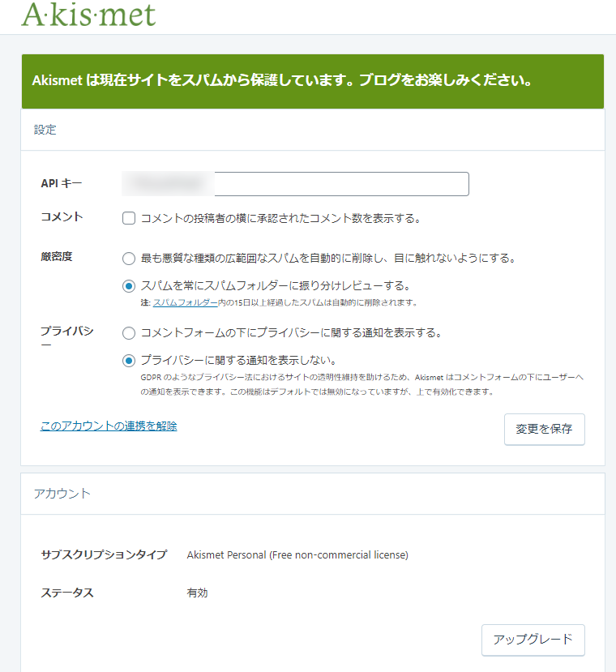

これで設定完了です。

## Wordfence Security

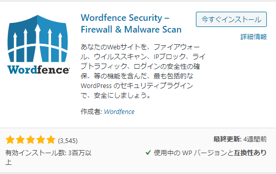

プラグインを検索してインストールし、有効化します。

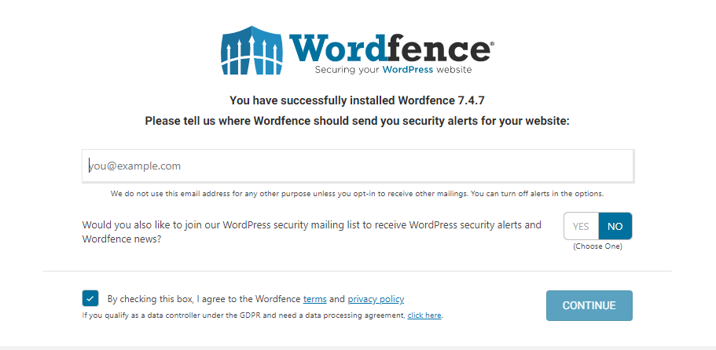

メールアドレスの登録を促されるので登録します。
WordPress や Wordfence のニュースを受け取るかどうか選びます。どちらでもいいです。
プライバシーポリシーにはチェックを入れましょう。

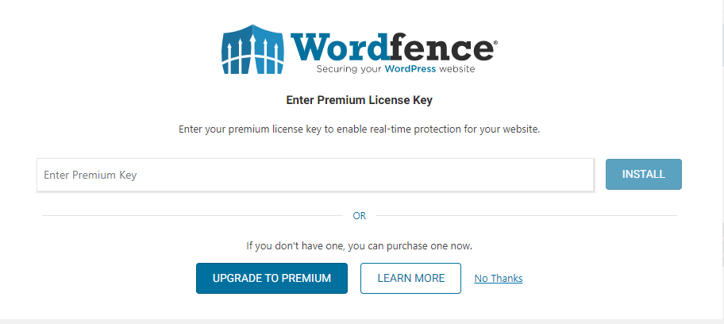

「CONTINUE」をクリックするとライセンスキーの入力の画面に遷移しますが、持っていないので「No Thanks」を選びます。

以上でインストールは完了ですが、インストール後の詳細設定はこちらの記事が参考になります。

[https://easy-wordpress.work/wordpress/security-wordfence/](https://easy-wordpress.work/wordpress/security-wordfence/)
## SiteGuard WP Plugin

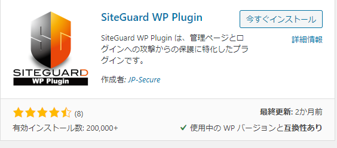

プラグインを検索してインストールし、有効化します。

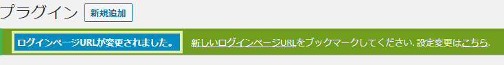

プラグインを有効化すると強制的にログインページの URL が変更されます。
個人のブログでは問題ないのですが、客先等で共有している場合は変更しない方がいいかもしれません。

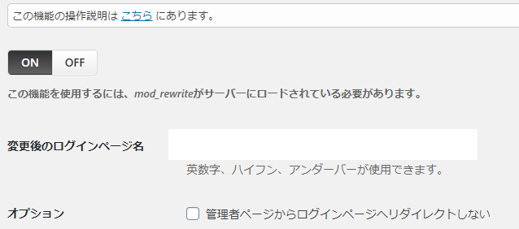

左のメニューから「SiteGuard」→「ログインページ変更」→「ON/OFF」で変更できます。また、このページではログインページの URL も確認できます。

SiteGuard の詳細設定はこちらが参考になります。

[https://webst8.com/blog/wordpress-siteguard/](https://webst8.com/blog/wordpress-siteguard/)
#### 通知を消す

常時表示されているのは気になるので消します。

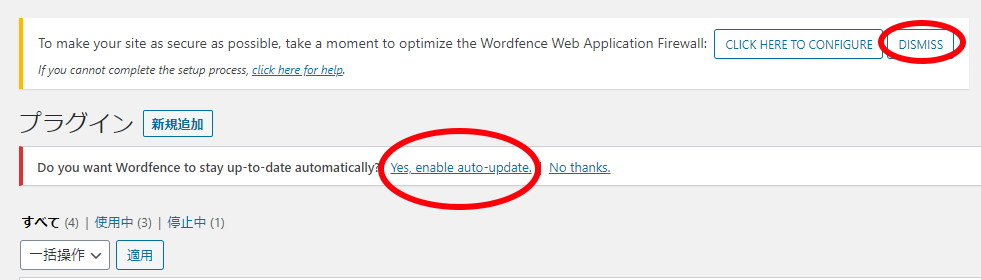

「DISMISS」と「Yes. enable auto update」を選択すると表示が消えます。
