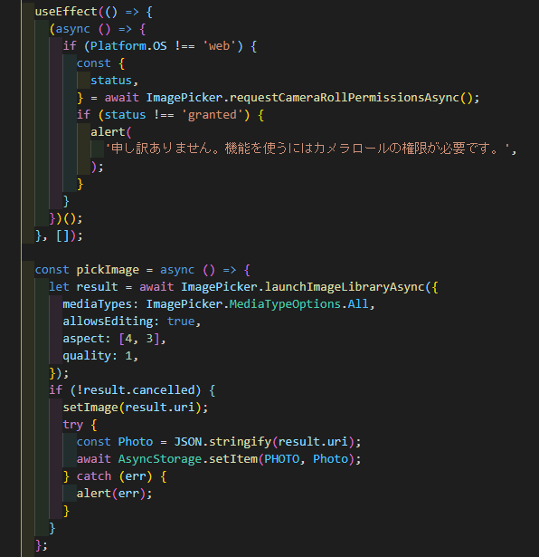
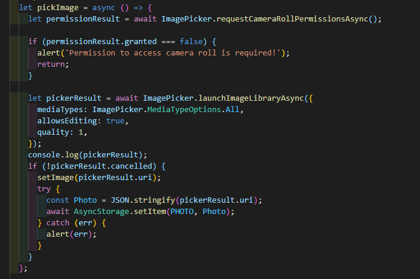
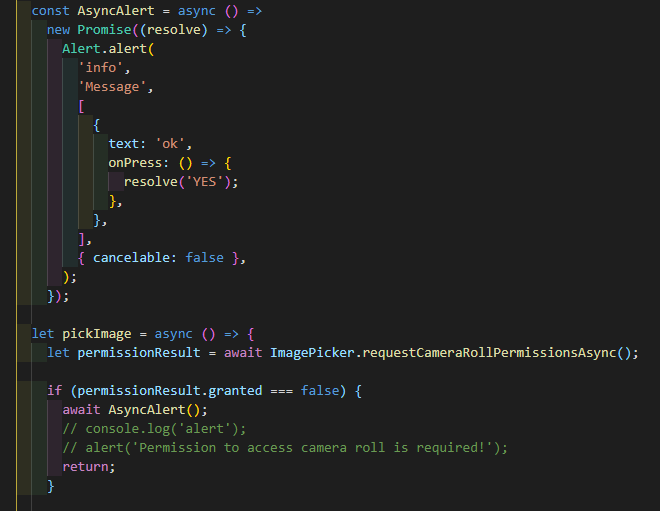
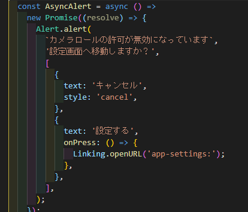
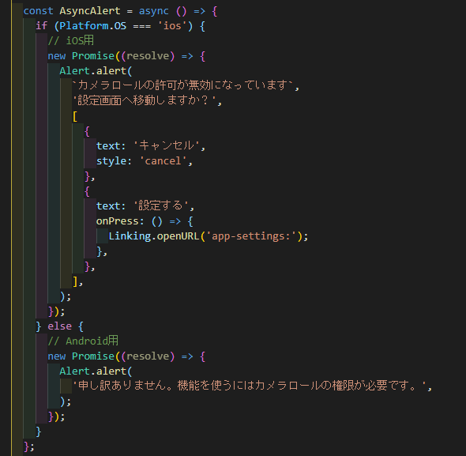

公式ドキュメントを参考にしたはずだけど、初回起動時の Permission で拒否したらずっと alert が出るようになってしまうし、その上拒否したにも関わらず強行突破でカメラロールにアクセスできてしまう。

[https://docs.expo.io/versions/latest/sdk/imagepicker/](https://docs.expo.io/versions/latest/sdk/imagepicker/)

公式に ImagePicker の別のページがあったのでそっちのコードを参考にしてみた。

[https://docs.expo.io/tutorial/image-picker/](https://docs.expo.io/tutorial/image-picker/)

「写真を選ぶ」を押すと Alert が表示され、カメラロールへのアクセスを拒否してくれるが、一度拒否したらアプリ上から許可の設定を行う導線が消えてしまうので不親切。
Alert の場合再度 Permission の処理を行いたいが、Alert は処理を待ってくれないので工夫しなければならない。

そこで ReactNative の Alert を利用する。

[https://reactnative.dev/docs/alert](https://reactnative.dev/docs/alert)

本当は再度許可するかどうかのウィンドウを出したかったのだけど、うまくいかなかったので直接設定画面をひらくようにする。

これで一応、無許可でカメラロールにアクセスすることも回避できて、許可していなかった場合に設定できる導線も確保できた。
と、思ったらやはり Android だと設定画面にいかないので処理を分ける必要がある。

Android は許可していなかったら毎回許可するかのウィンドウがでるので、
メッセージのみの表示にした。
ひとまずこれで目的は達成できた。
