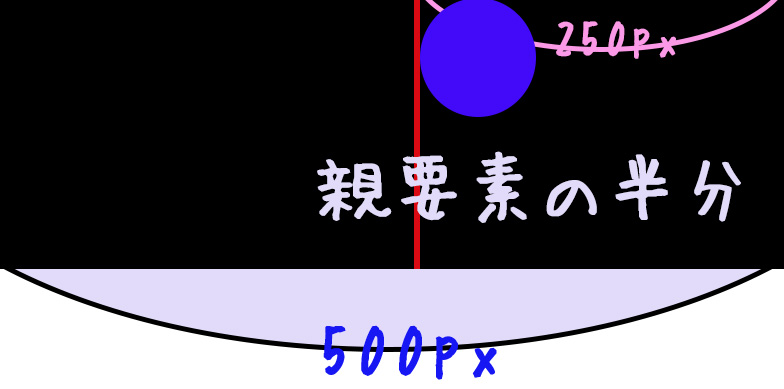

# ウィンドウサイズが可変で要素を中央維持する（左右）

CSS を学び始めた初期で躓いたやつです。
考え方はこうです。

1. 親要素の半分の位置にする
2. 子要素の幅を半分戻す
3. 中心が合う

説明はいいからコードだけほしいという方は最後まで飛ばしてください。

## 親要素の半分の位置にする



親を基準にして位置調整を行うのでpositionを使います。

```css
親{
  position:relative;
}
子{
  position:absolute;
}
```

これで親要素を基準に子要素の位置を決められるようになりました。まずは半分の位置にしたいのですが、

```css
子{
position:absolute;
left:250px;
}
```

とかやってしまうと、可変の時に中心がずれるのでやってはいけない。

```css
子{
  position:absolute;
  left:50%;
}
```

これで子要素の頭の位置が常に中心になりました。ただし頭の位置なので、子要素の中心とはまだあっていません。

## 子要素の幅を**半分戻す**


ここで注意するのは子要素のサイズも可変だとうまくいかないことです。例えば子要素が img とかでウィンドウサイズに合わせて可変するようでしたら固定します。（あくまで今回は）

```css
子{
position:absolute;
left:50%;
width:80px;
margin-left:-40px;
}
```

## **中心が合う**（完成コード）

子要素の width を固定して、その半分をマイナスで戻せば完成です。


最後にコードをまとめておきます。

```css
親{
  position:relative;
}
子{
  position:absolute;
  left:50%;
  width:80px;
  margin-left:-40px;
}
```
