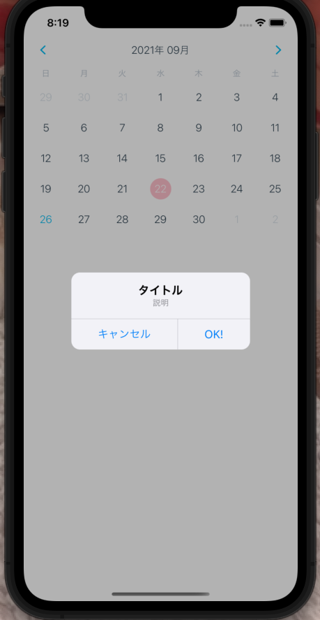

# 第 2 回 ReactNative アプリ開発 ③〜ダイアログ実装

## ライブラリ選定

ReactNative のダイアログ実装で検索すると有名そうなところで２つひっかかってくる。

[https://github.com/douglasjunior/react-native-simple-dialogs](https://github.com/douglasjunior/react-native-simple-dialogs)

[https://github.com/mmazzarolo/react-native-dialog](https://github.com/mmazzarolo/react-native-dialog)

前者の[react-native-simple-dialogs](https://github.com/douglasjunior/react-native-simple-dialogs)は **「react native ダイアログ」** で検索すると１位にヒットする記事で紹介されているが、こちらのライブラリはもう更新されていない。
後者の[react-native-dialog](https://github.com/mmazzarolo/react-native-dialog)は現在(2021/09/26 執筆時）も更新されているので、今回はこちらを使用する。

## 使い方

### ライブラリインストール

まずは npm もしくは yarn でライブラリをインストールする

```sh
# Using npm:
$ npm install react-native-dialog
# Using yarn:
$ yarn add react-native-dialog
```

### 基本の形

先程インストールしたreact-native-dialog を import して使っていく。

```javascript
import Dialog from "react-native-dialog";

return (
  <View>
    <Dialog.Container>
      <Dialog.Title>Account delete</Dialog.Title>
      <Dialog.Description>
        Do you want to delete this account? You cannot undo this action.
      </Dialog.Description>
      <Dialog.Button label="Cancel" />
      <Dialog.Button label="Delete" />
    </Dialog.Container>
  </View>
);
```

react-native-dialog はいくつかの UI コンポーネントを使うことができ、それらを組み合わせることで、簡単にダイアログを実装できる。しかし、この状態では Button を押しても何も起きないので、より具体的な実装をする。

### 例

```jsx
import React, { useState } from "react";
import { Button, StyleSheet, View } from "react-native";
import Dialog from "react-native-dialog";

export default function App() {
  const [visible, setVisible] = useState(false);

  const showDialog = () => {
    setVisible(true);
  };

  const handleCancel = () => {
    setVisible(false);
  };

  const handleDelete = () => {
    setVisible(false);
  };

  return (
    <View style={styles.container}>
      <Button title="Show dialog" onPress={showDialog} />
      <Dialog.Container visible={visible}>
        <Dialog.Title>Account delete</Dialog.Title>
        <Dialog.Description>
          Do you want to delete this account? You cannot undo this action.
        </Dialog.Description>
        <Dialog.Button label="Cancel" onPress={handleCancel} />
        <Dialog.Button label="Delete" onPress={handleDelete} />
      </Dialog.Container>
    </View>
  );
}

const styles = StyleSheet.create({
  container: {
    flex: 1,
    backgroundColor: "#fff",
    alignItems: "center",
    justifyContent: "center",
  },
});
```


これで基本となるダイアログの実装ができた

## カレンダーに実装していく

```javascript
import { StatusBar } from "expo-status-bar";
import React, { useState } from "react";
import { StyleSheet, Text, View } from "react-native";
import { Calendar, LocaleConfig } from "react-native-calendars";
import Dialog from "react-native-dialog";
import moment from "moment";

const INITIAL_DATE = moment().format("YYYY-MM-DD");

export default function App() {
  const [selected, setSelected] = useState(INITIAL_DATE);
  const [visible, setVisible] = useState(false);

  const handleDayPress = (day) => {
    setSelected(day.dateString);
    showDialog();
  };

  const showDialog = () => {
    setVisible(true);
  };

  const handleCancel = () => {
    setVisible(false);
  };

  const handleConfirm = () => {
    setVisible(false);
  };

  return (
    <View style={{ paddingTop: 40, display: "flex" }}>
      <Calendar
        monthFormat={"yyyy年 MM月"}
        current={INITIAL_DATE}
        markedDates={{
          [selected]: {
            selected: true,
            disableTouchEvent: true,
            selectedColor: "pink",
            selectedTextColor: "white",
          },
        }}
        onDayPress={handleDayPress}
      />
      <Dialog.Container visible={visible}>
        <Dialog.Title>タイトル</Dialog.Title>
        <Dialog.Description>説明</Dialog.Description>
        <Dialog.Button label="キャンセル" onPress={handleCancel} />
        <Dialog.Button label="OK!" onPress={handleConfirm} />
      </Dialog.Container>
    </View>
  )
}

LocaleConfig.locales.jp = {
　today: "今日",
 monthNames: [ "1月", "2月", "3月", "4月", "5月", "6月", "7月", "8月", "9月", "10月", "11月", "12月", ],
 monthNamesShort: [ "1月", "2月", "3月", "4月", "5月", "6月", "7月", "8月", "9月", "10月", "11月", "12月", ],
 dayNames: [ "日曜日", "月曜日", "火曜日", "水曜日", "木曜日", "金曜日", "土曜日", ],
 dayNamesShort: ["日", "月", "火", "水", "木", "金", "土"],
};
LocaleConfig.defaultLocale = "jp";

````



日付を選択するとダイアログが表示する機能の実装ができました。
