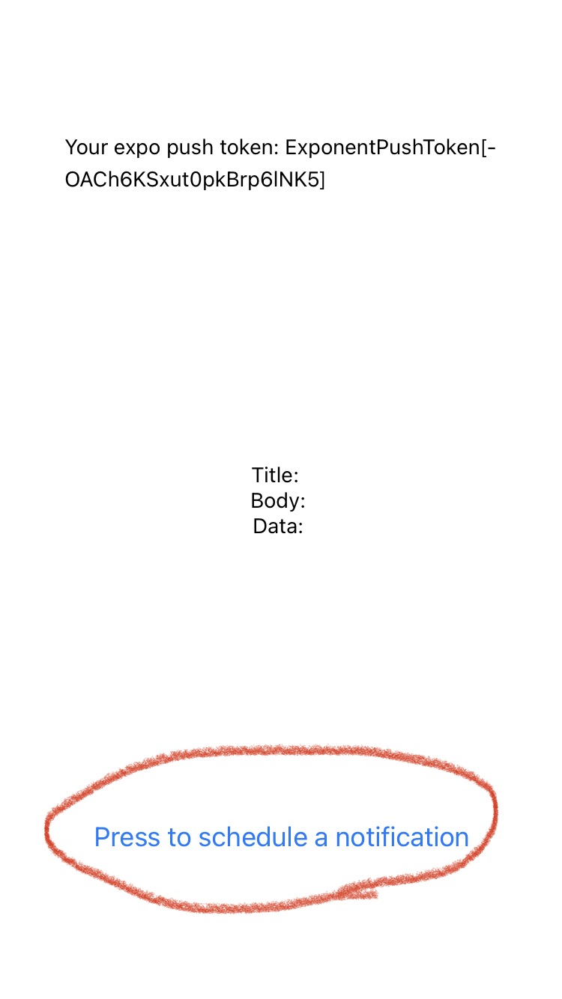
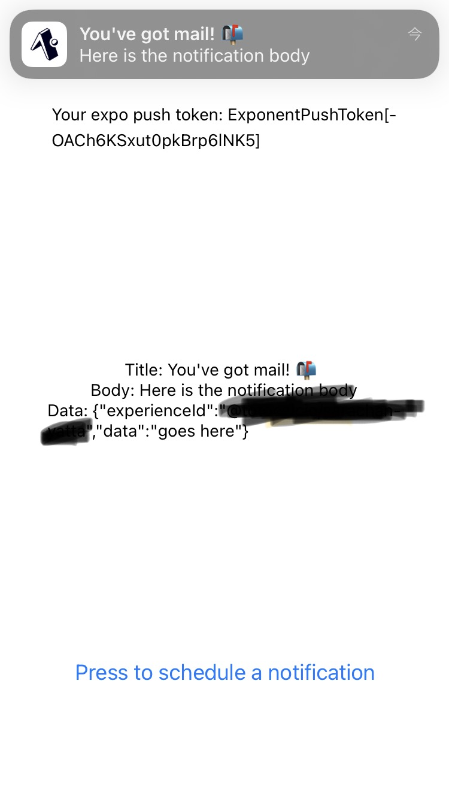

通知機能を足したいと思いまして**expo-notifications**を入れることにしました。
Expo 公式のもので更新頻度は（今のとこ）気にしなくてもよさそうなのでとりあえずドキュメントを見に行きます。

[https://docs.expo.dev/versions/v42.0.0/sdk/notifications/](https://docs.expo.dev/versions/v42.0.0/sdk/notifications/)

**注意** 

- 本記事で公式ドキュメントへのリンクを度々貼っていますが、導入の際には最新のドキュメントを参考にしてください。
- ググるといろんな expo-notifications に関するサンプルコードも出てくると思います。（私のように慣れないエンジニアはそのままコピペしたいとこですが、あくまで参考程度にして、最新の公式ドキュメントを見た方がいいです。expo-notifications に限ったことではないですけど。

## インストール

[ドキュメント](https://docs.expo.dev/versions/latest/sdk/notifications/#installation)に沿ってまずはインストール

```sh
$expo install expo-notifications
```

ドキュメントにはインストールのあとに[config](https://docs.expo.dev/versions/latest/sdk/notifications/#config-plugin-setup-optional)についてもありますが、こちらはカスタムなのでアイコンやサウンドなど、必要があれば設定してください。

## サンプルコード

まずは公式記載の[サンプルコード](https://docs.expo.dev/versions/latest/sdk/notifications/#api)をまるまるコピーしてきます。

```javascript
import Constants from 'expo-constants';
import * as Notifications from 'expo-notifications';
import React, { useState, useEffect, useRef } from 'react';
import { Text, View, Button, Platform } from 'react-native';

Notifications.setNotificationHandler({
  handleNotification: async () => ({
    shouldShowAlert: true,
    shouldPlaySound: false,
    shouldSetBadge: false,
  }),
});

export default function App() {
  const [expoPushToken, setExpoPushToken] = useState('');
  const [notification, setNotification] = useState(false);
  const notificationListener = useRef();
  const responseListener = useRef();

  useEffect(() => {
    registerForPushNotificationsAsync().then(token => setExpoPushToken(token));

    notificationListener.current = Notifications.addNotificationReceivedListener(notification => {
      setNotification(notification);
    });

    responseListener.current = Notifications.addNotificationResponseReceivedListener(response => {
      console.log(response);
    });

    return () => {
      Notifications.removeNotificationSubscription(notificationListener.current);
      Notifications.removeNotificationSubscription(responseListener.current);
    };
  }, []);

  return (
    <View
      style={{
        flex: 1,
        alignItems: 'center',
        justifyContent: 'space-around',
      }}>
      <Text>Your expo push token: {expoPushToken}</Text>
      <View style={{ alignItems: 'center', justifyContent: 'center' }}>
        <Text>Title: {notification && notification.request.content.title} </Text>
        <Text>Body: {notification && notification.request.content.body}</Text>
        <Text>Data: {notification && JSON.stringify(notification.request.content.data)}</Text>
      </View>
      <Button
        title="Press to schedule a notification"
        onPress={async () => {
          await schedulePushNotification();
        }}
      />
    </View>
  );
}

async function schedulePushNotification() {
  await Notifications.scheduleNotificationAsync({
    content: {
      title: "You've got mail! ?",
      body: 'Here is the notification body',
      data: { data: 'goes here' },
    },
    trigger: { seconds: 2 },
  });
}

async function registerForPushNotificationsAsync() {
  let token;
  if (Constants.isDevice) {
    const { status: existingStatus } = await Notifications.getPermissionsAsync();
    let finalStatus = existingStatus;
    if (existingStatus !== 'granted') {
      const { status } = await Notifications.requestPermissionsAsync();
      finalStatus = status;
    }
    if (finalStatus !== 'granted') {
      alert('Failed to get push token for push notification!');
      return;
    }
    token = (await Notifications.getExpoPushTokenAsync()).data;
    console.log(token);
  } else {
    alert('Must use physical device for Push Notifications');
  }

  if (Platform.OS === 'android') {
    Notifications.setNotificationChannelAsync('default', {
      name: 'default',
      importance: Notifications.AndroidImportance.MAX,
      vibrationPattern: [0, 250, 250, 250],
      lightColor: '#FF231F7C',
    });
  }

  return token;
}
```

**注意**

```html
この先Simulatorでは通知の確認ができないので実機で確認してください
```



Press to scheduls a notificationをタップします。



通知がきました。ここから少しカスタマイズしていきます。

## 通知のタイミングを変えたい（scheduleNotificationAsync）

通知の設定を行っているのはサンプルコードの中ではschedulePushNotificationのメソッドです。

```javascript
async function schedulePushNotification() {
  await Notifications.scheduleNotificationAsync({
    content: {
      title: "You've got mail! ?",
      body: 'Here is the notification body',
      data: { data: 'goes here' },
    },
    trigger: { seconds: 2 },
  });
}
```

その中で使われているscheduleNotificationAsyncの設定を変更するのですが、こちらの使い方についての詳細はドキュメントを確認してみてください。サンプルコードも一緒に掲載されています。
今回は毎日２３時に通知が来るように変更します。

```javascript
async function schedulePushNotification() {
  await Notifications.scheduleNotificationAsync({
    content: {
      title: "通知です",
      body: '通知きました',
    },
    trigger: {
      type: 'daily',
      repeats: true,
      hour: 23,
      minute: 0,
    },
  });
}
```

毎日決まった時間に通知するので[DailyNotificationTrigger](https://docs.expo.dev/versions/latest/sdk/notifications/#dailynotificationtrigger)定義を使用します。型定義の詳細については[こちら](https://docs.expo.dev/versions/latest/sdk/notifications/#notificationtriggerinput)を確認してください。

## 通知を止めたい(cancelAllScheduledNotificationsAsync)

通知を止めたい場合は[cancelScheduledNotificationAsync()](https://docs.expo.dev/versions/latest/sdk/notifications/#cancelschedulednotificationasyncidentifier-string-promisevoid)と[cancelAllAcheduledNotificationsAsync()](https://docs.expo.dev/versions/latest/sdk/notifications/#cancelallschedulednotificationsasync-promisevoid)がありますが特に細かいことは気にせず通知を止めたいだけなので、`cancelAllAcheduledNotificationsAsync()`を使用します。

```jsx
export default function App() {
...
  return (
    <View
      style={{
        flex: 1,
        alignItems: 'center',
        justifyContent: 'space-around',
      }}>
      ...
      <Button
        title="通知開始"
        onPress={async () => {
          await schedulePushNotification();
        }}
      />
      <Button
        title="通知終了"
        onPress={async () => {
          await cancelAllScheduledNotificationsAsync();
        }}
      />
    </View>
  );
}
...
async function cancelAllScheduledNotificationsAsync() {
  await Notifications.cancelAllScheduledNotificationsAsync();
}
```

## 通知音を鳴らしたい

サンプルコードのままでは通知音は鳴らないので、通知音が鳴るように設定します。

```jsx
Notifications.setNotificationHandler({
  handleNotification: async () => ({
    shouldShowAlert: true,
    shouldPlaySound: true,
    shouldSetBadge: false,
  }),
});
```

ドキュメントを確認してみてください。
次にschedulePushNotification()を修正します

```javascript
async function schedulePushNotification() {
  await Notifications.scheduleNotificationAsync({
    content: {
      title: "通知です",
      body: '通知きました',
      sound:'default'
    },
    trigger: {
      type: 'daily',
      repeats: true,
      hour: 23,
      minute: 0,
    },
  });
}
```

`content`に **sound:'default'** を追加します。これで通知音が鳴るようになりました。
